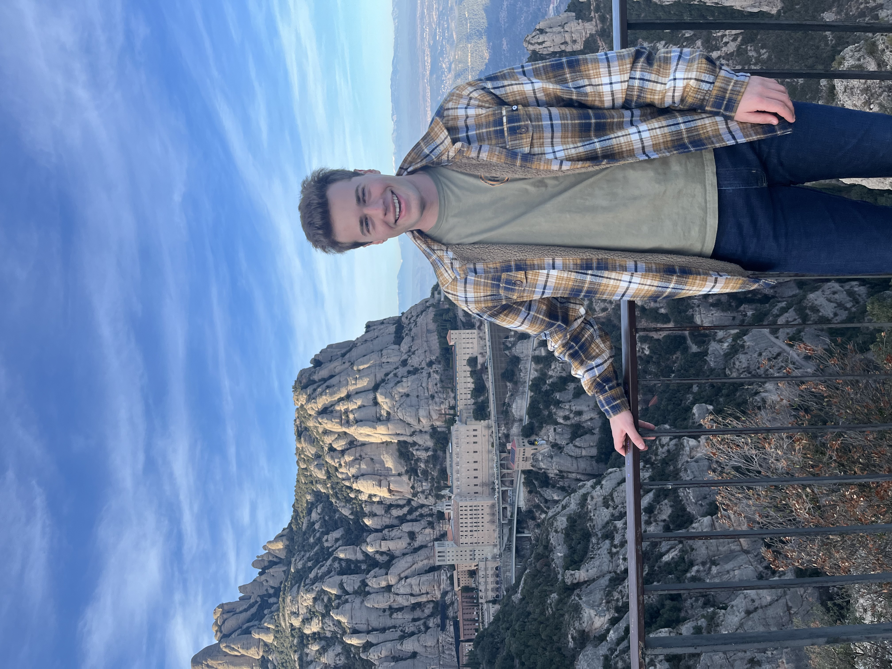

# About Me

## Ben Sheres

Hello! I'm a senior studying Computer Science and Urban Science with a minor in Mechanical Engineering (11-6 minor 2) at MIT. In my free time, I enjoy cooking, beach volleyball, and skiing.

## Background

I was born and raised in San Diego, California and currently reside in Boston, MA.

## Skills

- **Programming Languages**: Python, TS, JS, SQL, Matlab
- **Technologies/Tools**: CAD, GIS, Excel, Powerpoint
- **Other Skills**: [Design, Writing, Leadership, etc.]

## Experience

- **[Job Title]** at **[Company Name]**  
  _[Month, Year] - Present_  
  Responsibilities:

  - [List of responsibilities or achievements]

- **[Job Title]** at **[Company Name]**  
  _[Month, Year] - [Month, Year]_  
  Responsibilities:
  - [List of responsibilities or achievements]

## Education

- **[Degree]** in **[Field]** from **[University Name]**  
  _[Year]_

## Projects

### [Project Title 1]

Description of your project, what you did, and what technologies/tools were used.

### [Project Title 2]

Description of your project, highlighting the key skills you utilized.

## Hobbies & Interests

In my free time, I enjoy:

- [Hobby 1]
- [Hobby 2]
- [Hobby 3]

## Contact Me

Feel free to reach out via:

- **Email**: [Your Email]
- **LinkedIn**: [Your LinkedIn URL]
- **GitHub**: [Your GitHub URL]

