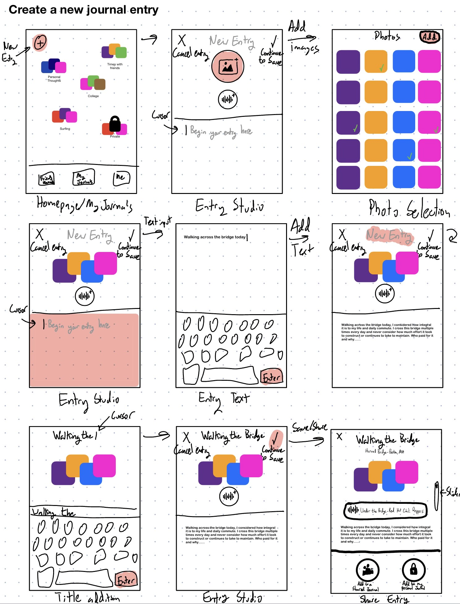
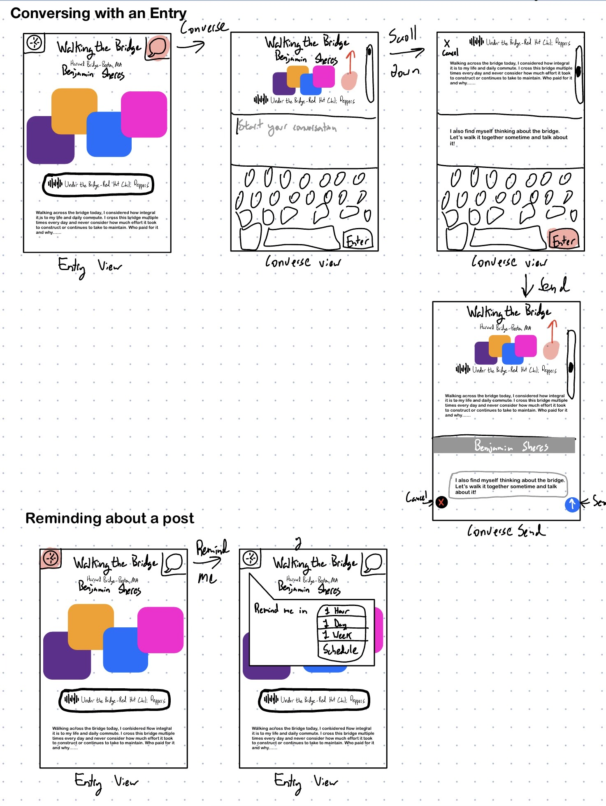

# Assignment 2: Divergent Design

## Application Goals

> OpenJournal
> An app for young people looking for a more personal way connect with their close friends
> OpenJournal is a personal journal/memory book where users are enocouraged to post both for their own memory but also to share deeper reflections with close friends to keep in touch on a more intimate level and spur conversations to be continued on iMessage.

## Scrapbook

# Highlights

The highlights feature from instagram allows users to organize and archive story posts by categories that they define. Although the bubbles with caption feel like a nice way to present categories, it might be nice to represent them in a way that shows a relational value (like timeline) to allow for more thoughtful organization. In OpenJournal, the highlight concept might be useful to allow users to categorize and organize their journals.

# Memories

The memories feature from snapchat allows users to save their images/posts on snapchat's servers instead of locally on their devices. Although this implies that you will take photos from the app and not the device's native photo app, the part of the concept that I'd like to elaborate on is for users to be able to save images and their accompanying journal entries privately for their own personal viewing or public sharing at a later time.

# Share Elsewhere

Share elsewhere allows users on snapchat to send snap stories or memories on other platforms. A similar feature exists on tik tok to allow you to share a post with someone not on the platform. That said, both of these features are designed to draw users into their ecosystem with tik tok bringing you to a web page and snapchat. OpenJournal's share feature will be designed to encourage continued conversations outside of the app.

# Stack of Photos

Taken from iMessage, in recent updates, when you share multiple photgos at once, they are presented to the receiving user in a stack that is easy to swipe through to quickly view all of them before deciding to magnify and actually inspect each one. OpenJournal could have a similar visibility feature to allow users to view either collections of their journals or individual journals easily before actually opening them up.

# Close friends

Instagram allows you to add other users to your account as "Close friends", granting them viewing priveledges on posts or stories that you designate as only for close friends. OpenJournal might have an option to select close friends to view more private posts or may choose to use more of a "private story" approach like snapchat where you can select exactly which friends can view a certain category.

# Flashbacks

Snapchat will periodically bring up old memories to remind users of what they took photos of or posted at different intervals (ex: one year ago today, one month ago, etc).
OpenJournal should have a similar functionality to support its role as a memory book for users.

# Audio

Instagram and snapchat both have features that allow users to add audio (usually in the form of music) over a post or story. OpenJournal will also allow for this but go one step further and allow users to stitch together audio files recorded on their own devices (or found elsewhere) to overlay on their journal entries. The idea is not to necesarily have a high-energy song playing over

## Feature Ideas Brainstorm

**Pages**

Each "page" of the app will contain a set of journal entries with a common theme, whether that be journal entries shared from friends, or a user's own journal entries.

**Workbook**

The workbook allows users to construct journal entries using a combination of longer-form text, images, and audio.

**Converse**

Converse allows you to write a response to a friend's public journal entry that will be sent to them in a shared iMessage chat to begin a conversation outside of OpenJournal.

**Pose**

Allows you to pose a question or journal entry to your friends on the app to respond in journal entries of their own.

**Respond**

Designates a journal entry as a response to another journal entry

**Threads**

Forms a relation between journal entries where entries become responses to the entry that came before it in the thread.

**My Journal**

A set of journal entries that are private to an individual user.

**Circles**

Allows you to select individual friends to add gain special priveledges as determined in settings including conversing, responding, viewing entries, and viewing what you pose.

**Remind Me**

Will remind you to look at a journal entry at a selected time or date in the future.

**Journals**

A collection of journal entries organized by a user on a common theme (location, time, other). Potentially will use AI to automatically analyze pictures and posts to sort them into journals.

**Automatic Location Generation**

When creating a journal entry including a(n) image(s) with locations enabled, OpenJournal will automatically suggest locating the entry with that location.

**Memories**

Based on a variety of factors (current location, date, calendar?) OpenJournal will recommend you revisit an old journal entry.

**Lockout**

Users can set an amount of time to lock themselves out of OpenJournal with no option for an overide if they want to take a break from the app.

**Scheduling**

Users can schedule times or days of the week that they're able to use OpenJournal and will be locked out of it at all other times. Similarly, they could alot a certain amount of time they're able to use the app (like apple screen time without the override). They could also schedule when their journal entries will be visible to friends or when friends can converse with them.

**Dark Mode**

Temporarily remove your account and all associated Journals and Entries from public visibility on OpenJournal.

**Streak**

A count of the number of days in a row a user has created a journal entry to encourage a user to take the time to journal each day. Is only visible to that user.

**Me**

A journal entry that serves as a user's profile but is only available to friends

**Friends**

Users can reach friend status by both independently requesting to be friends with each other. This allows them access to view journal entries made visible to friends.

## VSD Analysis

**Non-targeted use**

OpenJournal is meant to be an app where users can record and/or private and trusted feelings and thoughts. Access to a user's account by unintended parties who may have access to their device can lead to breaches of confidence and privacy. In order to prevent this, a special passcode or face id lock to access certain journal entries or the entire account could be implemented.

**Long-term Health and Well-being**

OpenJournal is intended to be a platform for users to explore thoughtful, personal, and even potentially serious topics with the hope of making users more insightful and hopefully feel better. That said, social media has the potential to be a rabbit hole or echo chamber for bad mental health. In order to monitor this, a check-in feature where the app periodically polls users on how they're feeling could allow developers to understand if the app is actually encouraging and creating wellbeing.

**Desired Values**

OpenJournal's values center around openness, community trust, personal mental health, and individual relationships. This platform is not designed for people to broadcast their opinions or feelings to large audiences but rather to share them with hand-picked peers. One critical factor in creating a platform focused on these ideals is who users are able to interact with. As a result, its important to ensure that the process of adding friends is mutual and does not encouraging bulk-friending.

**Choosing not to use**

The choice not to use OpenJournal should be easy and have no impact on a users life. Given its more intimate and personal design, non-users shouldn't feel any form of pressure to join the app or any "fomo". Our app relies on users being interested in sharing or storing personal anecdotes, and has a strong requirement to opt-in. Although this may affect its traction, it will keep it easy to not use.

**Reappropriation**

One community that could very easily reappropriate the app would be the community of mental health professionals. The apps design would lend itself well to interactions between therapists and patients or help therapists remind their patients to focus on certain components of their life while simeltaneously providing a platform for the patient to privately reflect. Adding more features surrounding privacy protection would be prudent to gain more user trust about recording sensitive content.

**Adaptation**

One lifestyle change that OpenJournal might support is increased mindfulness of users. Being given the opportunity to respond to posed questsions and record/remember ones own experiences will hopefully have the affect of making a user more mindful about themself.

## Storyboard and Sketching

