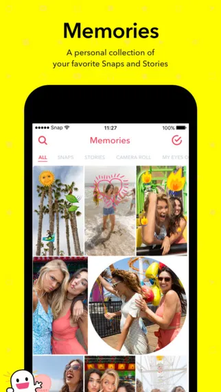
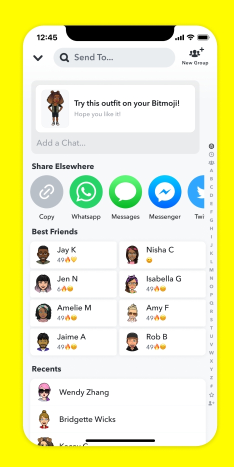
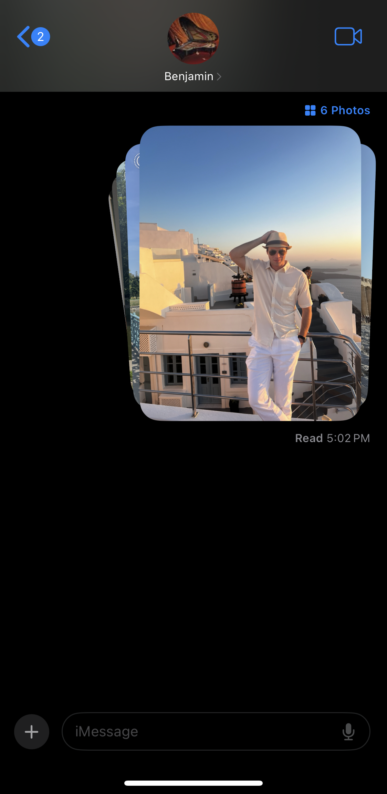
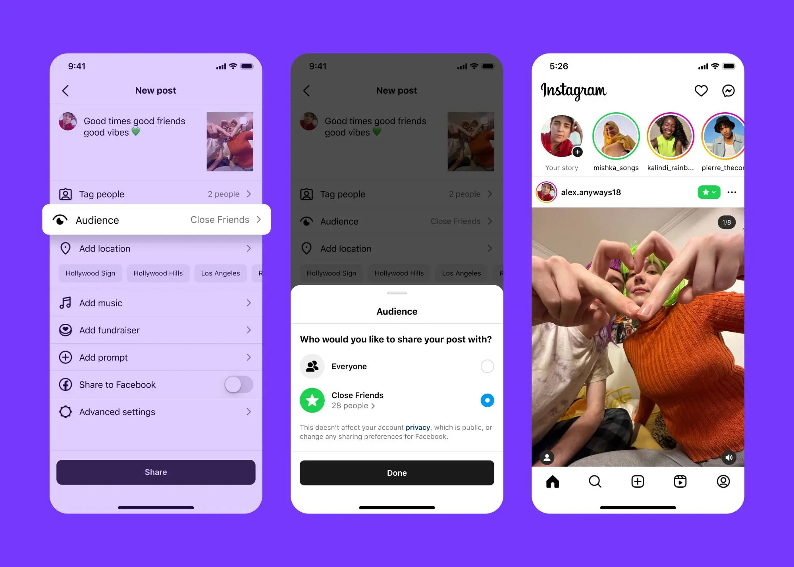
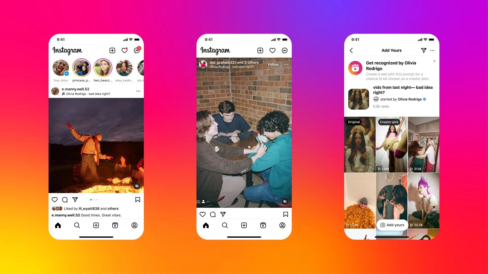

# Assignment 2: Divergent Design

## Application Goals

> OpenJournal
> An app for young people looking for a more personal way connect with their close friends
> OpenJournal is a personal journal/memory book where users are enocouraged to post both for their own memory but also to share deeper thoughts with close friends both to keep in touch on a slightly more intimate level but also begin conversations to be continued on iMessage.

## Scrapbook

# Highlights

  
  
  

The highlights feature from instagram allows users to organize and archive story posts by categories that they define. Although the bubbles with caption feel like a nice way to present categories, it might be nice to represent them in a way that shows a relational value (like timeline) to allow for more thoughtful organization. In OpenJournal, the highlight concept might be useful to allow users to categorize and organize their journals.

# Memories

The memories feature from snapchat allows users to save their images/posts on snapchat's servers instead of locally on their devices. Although this implies that you will take photos from the app and not the device's native photo app, the part of the concept that I'd like to elaborate on is for users to be able to save images and their accompanying journal entries privately for their own personal viewing or public sharing at a later time.

# Share Elsewhere

Share elsewhere allows users on snapchat to send snap stories or memories on other platforms. A similar feature exists on tik tok to allow you to share a post with someone not on the platform. That said, both of these features are designed to draw users into their ecosystem with tik tok bringing you to a web page and snapchat. OpenJournal's share feature will be designed to encourage continued conversations outside of the app.

# Stack of Photos

Taken from iMessage, in recent updates, when you share multiple photos at once, they are presented to the receiving user in a stack that is easy to swipe through to quickly view all of them before deciding to magnify and actually inspect each one. OpenJournal could have a similar visibility feature to allow users to view either collections of their journals or individual journals easily before actually opening them up.

# Close friends

Instagram allows you to add other users to your account as "Close friends", granting them viewing priveledges on posts or stories that you designate as only for close friends. OpenJournal might have an option to select close friends to view more private posts or may choose to use more of a "private story" approach like snapchat where you can select exactly which friends can view a certain category.

# Flashbacks

Snapchat will periodically bring up old memories to remind users of what they took photos of or posted at different intervals (ex: one year ago today, one month ago, etc).
OpenJournal should have a similar functionality to support its role as a memory book for users.

# Audio

Instagram and snapchat both have features that allow users to add audio (usually in the form of music) over a post or story. OpenJournal will also allow for this but go one step further and allow users to stitch together audio files recorded on their own devices (or found elsewhere) to overlay on their journal entries. The idea is not to necesarily have a high-energy song playing over

## Feature Ideas Brainstorm

**Entry**
