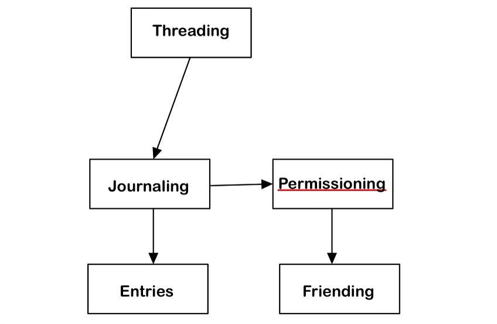

# Assignment 3: Convergent Design

## Pitch

> OpenJournal is a social media app that allows you to focus on what matters: you and your friends. Today, mainstream social media apps have lost track of what made them special to begin with. With OpenJournal you can create a journal of memories and thoughts for yourself but also choose to share parts with your closest friends. Unlike other apps, its not designed to pull you in. Rather, its built to help you connect with yourself and friends on a deeper level. OpenJournal is meant to help you live life to the fullest, by allowing providing a simple platform to stay in touch with yourself and thoughtfully engaging with friends. OpenJournal is centered around Journal Entries, longform posts that you can create for yourself, create to spark thought or conversation with friends, or respond to a friend.

## Concepts

# Entry \[Text, Image]

|                       |                                                                                              |
| :-------------------: | :------------------------------------------------------------------------------------------: |
|        Purpose        | To allow users to record and/or communicate their thoughts and feelings via text and visuals |
| Operational Principle |      A user writes a piece of text to accompany some visuals and it can be viewed later      |
|         State         |                              caption: Text, visuals: set Image                               |
|        Actions        |                       create(text: String, visuals: Image[]), show();                        |

# Journaling \[Entry]

|                       |                                                                                   |
| :-------------------: | :-------------------------------------------------------------------------------: |
|        Purpose        | Store and access multiple entries in one location based on a common theme/purpose |
| Operational Principle |             You put your entries in a journal to keep them organized              |
|         State         |                               entries: Set\[Entry]                                |
|        Actions        |           create(name: String), add(entry: Entry); remove(entry: Entry)           |

# Threading \[Object]

|                       |                                                                                  |
| :-------------------: | :------------------------------------------------------------------------------: |
|        Purpose        |     Create a linear ordered relationship between multiple of the same object     |
| Operational Principle | Given an object, if you want a new object to follow it, you add it to the thread |
|         State         |     object: Object -> 1 parent: Object, object: Object -> 0-1 child: Object      |
|        Actions        |   makeThread(head: Object), addToEnd(object: Object), hasNext(object: Object)    |

# Friending \[Party]

|                       |                                                                               |
| :-------------------: | :---------------------------------------------------------------------------: |
|        Purpose        |                   Distinguish a party as special to a user                    |
| Operational Principle |   You want a user on an app to be closer to you so you add them as a friend   |
|         State         |                         friends: set of Party objects                         |
|        Actions        | befriend(friend: Party), unfriend(friend: Party), checkFriends(friend: Party) |

# Permissioning \[Party, Action]

|                       |                                                                                                                            |
| :-------------------: | :------------------------------------------------------------------------------------------------------------------------: |
|        Purpose        |                             To discern certain parties as being allowed to do certain actions                              |
| Operational Principle |                   You want to allow friend Z to come to your house so you give them permission to do so                    |
|         State         |                                        action: Action -> permitted: Set of Parties                                         |
|        Actions        | grantPerm(party: Party, action: Action), checkPerm(party: Party, action: Action), removePerm(party: Party, action: Action) |

## Synchronizations

sync post(poster: Party, text: String, images: Image, journal: Journal)

- const myEntry = Entry.create(text, images)
- if checkPerm(poster, Journalviewers)(journal.add(myEntry)) else (throw error)
- newThread = Threading.makeThread(myEntry)

sync respond(poster: Party, respondTo: Thread, text: String, image: Image)

- const response = Entry.create(text, images)
- if (checkPerm(poster, Journalviewers) && !hasNext(respondTo)){respondTo.journal.add(myEntry)} else {throw error}
- respondTo.addToEnd(response)

sync createJournal(owner: Party, name: String, members: Party[])

- const Journal = Journal.create(name)
- Owner.Friending.checkFriend(members)
- Permissioning.grantPerm(members, viewJournal)

sync viewEntry(poster: Party, viewer: Party, post: Entry)

- if (Entry.Journal.checkPerm(viewer, view)) {post.show()}

## Dependencies

## Wireframes

## Notes

I initially came up with too many unrelated concepts that didn't sync up to create any features. I was also missing the concept of permissioning and friending that would allow users to only have their posts viewed by specific other users and make journals special. As well, it took a couple of iterations to fully flesh out what actions would be necessary. Ulimately, I feel I was able to create a suite of concepts that are intrinsically independent and cover a basic suite of functionality that I intend to incorporate in my app although I am missing any concepts related to users and users logging in.

## Tradeoffs

1. Who's on first? The first tradeoff that I had to consider was what level to manage friends, privacy, and visibility since there are two levels that it could be managed at: the post level and the journal level. I want users to think about sharing journal entries as something they do with a predetermined group and not a decision that needs to be made each time they make a new entry. Conversely, if a friend can see a certain journal, they should be able to see all associated entries and not just a specific subset. As a result, I decided to handle the sharing permission at the journal level where anyone who is added to a journal can see all entries inside of it and even post if allowed.

2. So, what are we? The second tradeoff I had to consider was the manner in which friends add each other. Although it isn't specified by a synchronization, I wanted to make the friend process as minimally invasive as possible; importantly, users cannot find a publicly available list of friends to easily add people they might not be as close with, and there is no "request" feature or ability to see who wants to be friends with you. If you try to add someone as a friend, it will not notify them, but will automatically display that you are both friends if the other user has also added you.

3. Not all at once! The third design decision I made was regarding responses and if one entry could have more than one response. In order to be able to more linearly display responses as actual threads instead of pairs, I decided to only allow each entry to have one response so threads will be linear and not form trees.
