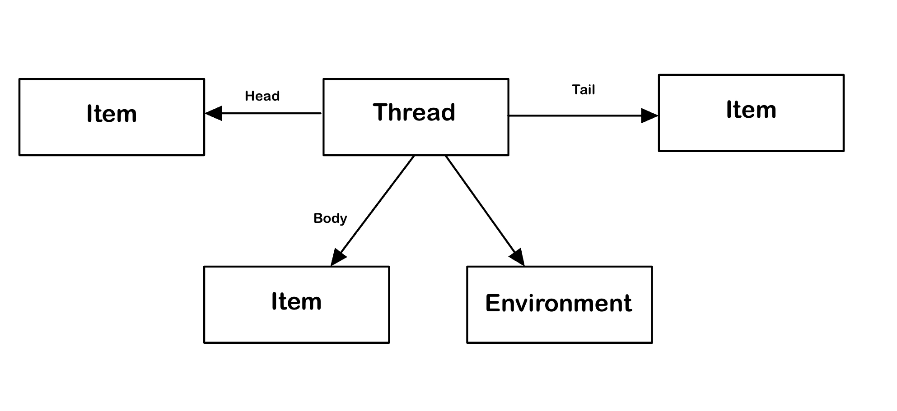

# Assignment 4: Backend Design and Implementation

<a href="https://104-backend-starter-bu3vvith4-bens-projects-7aa61185.vercel.app/">Vercel Deployment</a> 
<a href="https://github.com/therealnalm/104-backend-starter">Backend Starter GitHub</a>

## Data Modeling

# Entry \[User, Text]

|                       |                                                                                                                                                                                                                                             |
| :-------------------: | :-----------------------------------------------------------------------------------------------------------------------------------------------------------------------------------------------------------------------------------------: |
|        Purpose        |                                                                              To allow users to record and/or communicate their thoughts and feelings via text                                                                               |
| Operational Principle |                                                                             A user writes a piece of text to accompany some visuals and it can be viewed later                                                                              |
|         State         |                                                                                                    Entry -> author: Text, content: Text                                                                                                     |
|        Actions        | _create(author: User text: String)_ Create a new entry  _show(entry: Entry)_ Given an entry, return its content  _delete(entry: Entry)_ delete a certain post  _edit(entry: Entry, content:string, img: Image)_ Edit a given entry |

# Journaling \[Item, User]

|                       |                                                                                                                                                                                                                                                                                                                                                                                        |
| :-------------------: | :------------------------------------------------------------------------------------------------------------------------------------------------------------------------------------------------------------------------------------------------------------------------------------------------------------------------------------------------------------------------------------: |
|        Purpose        |                                                                                                                                                    Store and access multiple items in one location based on a common theme/purpose                                                                                                                                                     |
| Operational Principle |                                                                                                                                                                You put your entries in a journal to keep them organized                                                                                                                                                                |
|         State         |                                                                                                                                                                         name, owner -> contents: Item[], Topic                                                                                                                                                                         |
|        Actions        | _create(name: String, owner: User)_ Creates a new Journal owned by a certain user  _add(journal: Journal, item: Item)_ Add an item to a specific journal   _remove(journal: Journal, item: Item)_ Remove an item from a specific journal  _getItems(journal:Journal)_ gets all the items contained in a given journal   _delete(journal:Journal)_ Delete a certain journal |

# Threading \[Item, Environment]

|                       |                                                                                                                                                                                                                                                                                                                                                                                |
| :-------------------: | :----------------------------------------------------------------------------------------------------------------------------------------------------------------------------------------------------------------------------------------------------------------------------------------------------------------------------------------------------------------------------: |
|        Purpose        |                                                                                                                                                     Create a linear ordered relationship between multiple of the same item                                                                                                                                                     |
| Operational Principle |                                                                     If you create an item that fits linearly after another one, you can add it to a thread and other can continue to add items to the tail of your item. That way people can see the items that came before and after yours in the thread                                                                      |
|         State         |                                                                                                                                                        \_id -> head: Item, tail: Item, body: Item\[], env: Environment                                                                                                                                                         |
|        Actions        | _addToThread(parent: Item, item: Item)_ Thread an item to the tail of another. Creates a new thread if the parent is unthreaded  _unthread(item:Item)_ remove an item from a thread it may be in   _getNext(item: Item)_ Given an item, get the next item in the thread it is in  _getPrev(item: Item)_ Given an item, get the item that came before it in the thread |

# Friending \[Party]

|                       |                                                                                                                                                                                                                                                                                                                                                          |
| :-------------------: | :------------------------------------------------------------------------------------------------------------------------------------------------------------------------------------------------------------------------------------------------------------------------------------------------------------------------------------------------------: |
|        Purpose        |                                                                                                                                                Distinguish a party as on a special list for another party                                                                                                                                                |
| Operational Principle |                                                                                                                                You want a user on an app to be distinguised as closer to you so you add them as a friend                                                                                                                                 |
|         State         |                                                                                                                                                              \_id -> from: Party, to: Party                                                                                                                                                              |
|        Actions        | _befriend(user: Party, friend: Party)_ Add a friend to the list of friends for a user  _unfriend(user: Party, friend: Party)_ Remove a party from a user's list of friends   _checkFriends(user: Party, user: Party)_ Check if two users have both friended each other  _getFriends(user:Party)_ Get a list of all the friends a user has added |

# Permissioning \[User, Action]

|                       |                                                                                                                                                                                                                                                                                                                                                                                                                                                                                                                               |
| :-------------------: | :---------------------------------------------------------------------------------------------------------------------------------------------------------------------------------------------------------------------------------------------------------------------------------------------------------------------------------------------------------------------------------------------------------------------------------------------------------------------------------------------------------------------------: |
|        Purpose        |                                                                                                                                                                                                                               To discern certain parties as being allowed to do certain actions                                                                                                                                                                                                                               |
| Operational Principle |                                                                                                                                                                                                                     You want to allow friend Z to come to your house so you give them permission to do so                                                                                                                                                                                                                     |
|         State         |                                                                                                                                                                                                                                                       Action -> User\[]                                                                                                                                                                                                                                                       |
|        Actions        | _createPerm(action: Action)_ Creates a new action to allow perms for  _getAuthorizedActions(user: User)_ Gets the list of actions a user has permission to do   _giveUserPerm(user: User, action: Action)_ Gives a user permission to do a certain action   _removeUserPerm(user: User, action: Action)_ Remove a user from an action's permission list  _hasPerm(user: User, action: Action)_ Check if a user has permissions for a given action  _delPerm(action: Action)_ Delete a permission list entirely |

    **OpenJournal = Entry(user<Authing.User>, string) + Journaling(user<user>, Item<Entry>) + Threading(Item<Entry>, Environment<Journal>) + Friending(user<User>) + Permissioning(Party<Authing.user>, action<Journal>)**

## Data Representation

**Journaling**
Journaling is represented as the names of each journal where each name is mapped to an array of the objects contained inside of it. My current representation requires that all journals have unique names which is a shortsight considering multiple users may want to create their own journals with the same name. I'm not sure whether that distinction should be stored in the concept or in the syncing for the app. Additionally I'm not including any of the permissioning in the representation and plan to do that at a higher level sync although it seems like it would be much easier to do so within the actual journal rep.

Update: I decided that journals would need owners as part of the concept so I've gone ahead and added an owner field to the journals

**Permissioning**
Permissioning is represented where each user has their own permissioning doc that stores their user as well as an array of permission that they have. I struggled to determine how to represent these permissions since it is a bit challenging for equality-checking to compare functions stored elsewhere but am hoping that I can store each perm as the string of the journal they have access to since journals are all unique. Additionally, as I'm implementing permissioning, I'm realizing its actually very similar to journaling and I'm not sure if they should just be built off the same concept...

## Restful Routes

Threads

createThread(session: SessionDoc, journal: ObjectId, entry: ObjectId, head: ObjectId)- post("/thread")
removeFromThread(session: SessionDoc, journal: ObjectId, entry: ObjectId)- delete("/thread")
getNextInThread(session: SessionDoc, journal: ObjectId, entry: ObjectId)- get("/thread/next")
getPrevInThread(session: SessionDoc, journal: ObjectId, entry: ObjectId)- get("/thread/prev")
getThread(session: SessionDoc, journal: ObjectId, entry: ObjectId)- get("/thread")

journals

createJournal(session: SessionDoc, journal: string)- post("/journals")
deleteJournal(session: SessionDoc, journalid: string)- delete("/journals")
getAllJournals(session: SessionDoc)- get("/journals")
addJournalEntry(session: SessionDoc, journalid: string, entry: Object)- post("/journals/:journalid")
removeJournalEntry(session: SessionDoc, journalid: string, \_id: string)- delete("/journals/:journalid/:\_id")
getJournalContents(session: SessionDoc, journalid: string)- get("/journals/:journalid")
addJournalUser(session: SessionDoc, journalid: string, username: string)- post("/journals/users/:username")
removeJournalUser(session: SessionDoc, journalid: string, username: string)- delete("/journals/users/:username")
getJournalUsers(session: SessionDoc, journalid: string)- get("/journals/users")

friends

getAddedFriends(session: SessionDoc)- get("/friends")
removeFriend(session: SessionDoc, friend: string)- delete("/friends/:friend")
addFriend(session: SessionDoc, to: string)- post("/friend/add/:to")

## Synchronizations

User: Jack:  
pw: Jack
post : JackPost: 670890eb0f86e4616b1e2ea2
Journal: Jack Journal: 6708912b4b78e59b56584112

## Deployment

## Design Reflections

Permissioning: After the initial milestone, I decided to change the design of my permissioning concept. Whereas originally the state contained a mapping of users to the journals, I changed my mind and decided to map from individual journals to the users that can view/use them. This should make syncing journaling with the permission concept easier for creation of new journals. Although it will be a bit harder for users to quickly query which journals they have access to, it should still be doable.

Threading: I spent a while considering the implications of how I implement my threading concept and ultimately decided that each object can only occupy one location in one thread. I wanted threads to be linear for ease of viewing, so that means that only one post can be threaded to the tail of another. Since entries are all contained within individual journals, threads must also be contained within journals. This makes them rather suceptible to trolling attacks where one authorized user could continually add spam entries to the tail of one thread. That said, if the owner of the journal removes them from the journal, their posts would be removed and the thread would have all open ends connected to fill in for the missing spam posts. Update: Despite how badly I wanted to implement threading as linked lists in the database, I had a very strong feeling that needing to make a query to the server each time I want to move one link up would be incredibly inefficient so I'm choosing instead to implement threads as lists

Friending: I also decided to refactor the provided friending code in order to implement it for the functionality I was planning.

Posting vs. Entrying: I decided to refactor and extend upon the provided posting code to create my Entry concept since they were very similar with the only main difference being the lack of images from posting.
