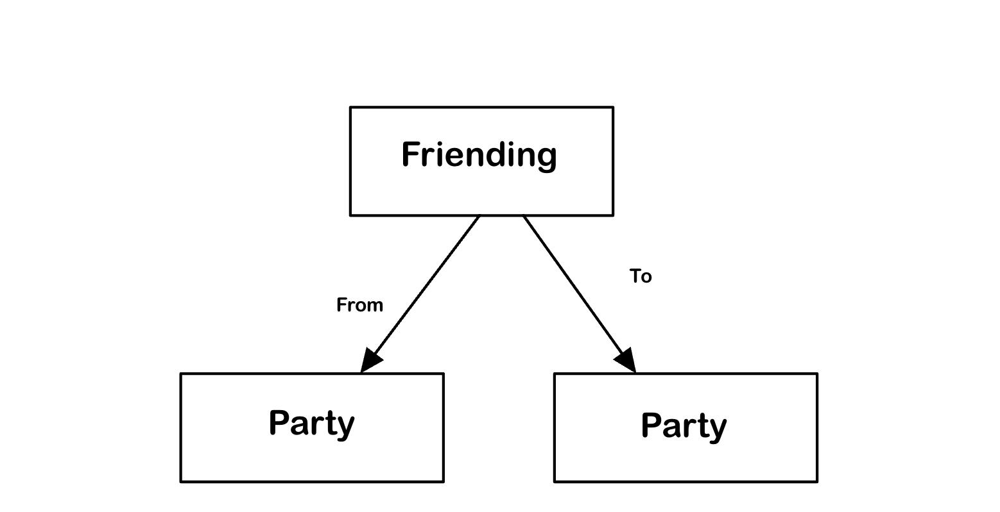

# Assignment 4: Backend Design and Implementation

<a href="https://104-backend-starter-bu3vvith4-bens-projects-7aa61185.vercel.app/">Vercel Deployment</a> 
<a href="https://github.com/therealnalm/104-backend-starter">Backend Starter GitHub</a>

## Data Modeling

# Entry \[User, Text, Image]

|                       |                                                                                                                                            |
| :-------------------: | :----------------------------------------------------------------------------------------------------------------------------------------: |
|        Purpose        |                        To allow users to record and/or communicate their thoughts and feelings via text and visuals                        |
| Operational Principle |                             A user writes a piece of text to accompany some visuals and it can be viewed later                             |
|         State         |                                              id -> author: string, content: string, img: img                                               |
|        Actions        | create(author: User text: String, visual: Image), show(entry: Entry), delete(entry: Entry), edit(entry: Entry, content:string, img: Image) |

# Journaling \[Content, User]

|                       |                                                                                   |
| :-------------------: | :-------------------------------------------------------------------------------: |
|        Purpose        | Store and access multiple entries in one location based on a common theme/purpose |
| Operational Principle |             You put your entries in a journal to keep them organized              |
|         State         |                          name, owner -> Array \<Content>                          |
|        Actions        | create(name: String, owner: USer), add(object: Content); remove(object: Content)  |

# Threading \[Object]

|                       |                                                                                                     |
| :-------------------: | :-------------------------------------------------------------------------------------------------: |
|        Purpose        |              Create a linear ordered relationship between multiple of the same object               |
| Operational Principle |      Given an object, if you want a new object to follow it, thread the new one to the old one      |
|         State         |               object: Object -> 1 parent: Object, object: Object -> 0-1 child: Object               |
|        Actions        | makeThread(head: Object), addToEnd(object: Object), getNext(object: Object) getPrev(object: Object) |

# Friending \[Party]

|                       |                                                                                                                      |
| :-------------------: | :------------------------------------------------------------------------------------------------------------------: |
|        Purpose        |                                       Distinguish a party as special to a user                                       |
| Operational Principle |                      You want a user on an app to be closer to you so you add them as a friend                       |
|         State         |                                               Party -> Array \<Party>                                                |
|        Actions        | befriend(user: Party, friend: Party), unfriend(user: Party, friend: Party), checkFriends(user: Party, friend: Party) |

# Permissioning \[Party, Action]

|                       |                                                                                                                            |
| :-------------------: | :------------------------------------------------------------------------------------------------------------------------: |
|        Purpose        |                             To discern certain parties as being allowed to do certain actions                              |
| Operational Principle |                   You want to allow friend Z to come to your house so you give them permission to do so                    |
|         State         |                                                  Party -> Array \<Action>                                                  |
|        Actions        | grantPerm(party: Party, action: Action), checkPerm(party: Party, action: Action), removePerm(party: Party, action: Action) |

    ** OpenJournal = Entry(User<user>, string, img) + Journaling(User<user>, Content<Entry>) + Threading(Object<Entry>) + Friending(Party<User>) + Permissioning(Party<User>, Action[])**

## Data Representation

**Journaling**
Journaling is represented as the names of each journal where each name is mapped to an array of the objects contained inside of it. My current representation requires that all journals have unique names which is a shortsight considering multiple users may want to create their own journals with the same name. I'm not sure whether that distinction should be stored in the concept or in the syncing for the app. Additionally I'm not including any of the permissioning in the representation and plan to do that at a higher level sync although it seems like it would be much easier to do so within the actual journal rep.

Update: I decided that journals would need owners as part of the concept so I've gone ahead and added an owner field to the journals

**Permissioning**
Permissioning is represented where each user has their own permissioning doc that stores their user as well as an array of permission that they have. I struggled to determine how to represent these permissions since it is a bit challenging for equality-checking to compare functions stored elsewhere but am hoping that I can store each perm as the string of the journal they have access to since journals are all unique. Additionally, as I'm implementing permissioning, I'm realizing its actually very similar to journaling and I'm not sure if they should just be built off the same concept...

## Restful Routes

## Synchronizations

## Deployment

## Design Reflections
