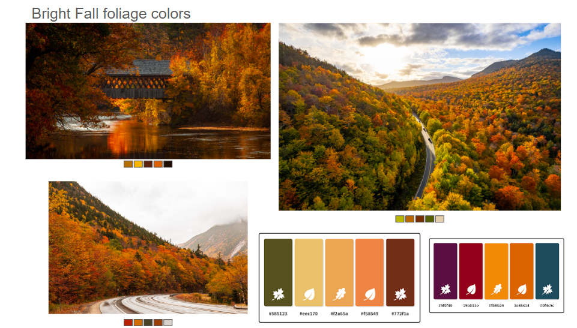
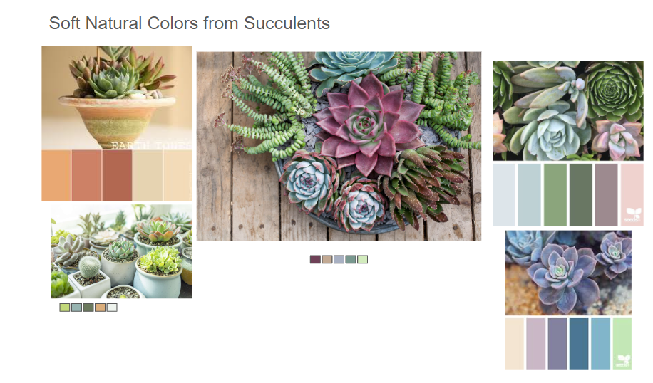

# Assignment 5: Backend Design and Implementation

> <a href="https://104-frontend-starter.vercel.app/">Vercel Deployment</a>  <a href="https://github.com/therealnalm/104-frontend-starter">Frontend Starter GitHub</a>

## Hueristic Evaluation

# Usability Criteria:

**Pleasantness**

- Designed to be highly pleasant with minimal text that needs reading, instead preferring simples symbols intended to convey meaning
- All buttons are rounded (mostly squares and circles) with relatively large diameters on the corners of squares
- Font choices (Itim and Inter) create a casual, informal aesthetic to make users feel more comfortable
- Pages providing multiple options (home page, entry creation page) aim to provide fewer options to minimize choices that potentially might stress users
- Softer primary colors were selected to be appealing and stimulating to users without clashing or creating too much contrast

  **Efficiency**

- All buttons occupy large amounts of the screen making for an easy time finding
- All actions (create journal, create/edit entry) can be done in very few clicks
- All processes are very simple and provide very few options
- Interface uses symbols to represent certain actions consistently across pages and also uses common color-coding to reinforce actions and user memory
- Options to continue/cancel are always located in the same spot on the page and represented the same way

# Physical Heuristics

**Fitt's Law**

- Interactive components far from the edge of the screen are larger making them easy to traverse to
- Interactive components close to the edge of the screen are a bit smaller since it is easier to travel to the edge and then move to the component
- Each page displays relatively few components at a time allowing for each one to be larger with more accesible via scrolling
- Buttons more likely to be pressed (continue, cancel) have been placed in corners making them highly accesible

**Gestalt Principle**

- Moving foward in processes (continue botton, submit button, finish button) have been placed on the right side of the interface while moving back (cancel, delete) has been placed on the right side
- Home bar has been laid out so that user's journal (what should be the most important) are centered, shared journals and on the left, and a user's profile is on the right. This also immitates other apps (instagram, snapchat)
- Finding/navigating existing content is down via the home bar on the bottom of the page while creating new content is done with buttons at the top of the home page

# Linguistic Level

**Consistency**

- The interface uses the same names, and colors for similar concepts and actions (red x for no/cancel actions, green check for yes/continue actions)
- The interface uses similar symbols (people for user functions/ group of people for shared functions) to other social media platforms revolving around post-type actions

**Information Scent**

- Although the interface does not have much text to describe the functions of each button, the tooltip will provide more info
- It could be useful to consider how to create a stronger information scent in certain processes

## Color Study

## Styling and Layout

I had grand visions for my layout and styling. Unfortunately, they became grand illusions because I spent 30 hours working on the app's functionality and didn't have any time left to style or upgrade the layout. Hopefully you can see the vision in my Heuristic evaluation.
