# Project Phase 2: Divergent Design

## Broad Application Goals

PlantIt is a project management app that incorporates the essential organizational functions of existing management apps with a gamified twist that is intended to motivate its users. While PlantIt can be used by anyone who has a project in mind, it is intended to bring the most value to **students and hobbyists**. PlantIt will extend beyond the scope of existing project management apps such as Notion, Mondays.com, and Jira, which tend to be targeted towards more professional and corporate environments. These apps do not incorporate reward systems, which has been [studied by behavioral psychologists](https://designli.co/blog/how-flora-app-developers-use-behavioral-psychology/) to improve user motivation. Furthermore, according to [this study](https://www.emerald.com/insight/content/doi/10.1108/IJMPB-04-2017-0035/full/html) via the International Journal of Managing Projects in Business, neglecting team motivation can significantly impair process performance. Thus, in addition to centralized organization, task delegation, and tracking, PlantIt sets itself apart by tackling user motivation--gamifying projects by rewarding its users with plants after the completion of tasks. This strategy of rewarding users with plants will largely appeal to an audience of non-professional users, since the gamification will be seen as a fun, motivating addition to the project management experience, rather than a distraction from work. This combination of efficient management and satisfying rewards allows users to produce the best quality results.

### PlantIt

PlantIt1 is your go-to solution for group project management. Stay on task with your teammates, track progress, and support each other while engaging with tasks in a way that's satisfying and motivational. As you grow with your team through the stages of your project you are also growing something else together. You're growing a digital plant that will find a home in your virtual garden upon completion of the project. The more efficiently you all work together, the more beautiful and impressive your garden will be.

1 Trademark

#### Intended Audience:

While we are building PlantIt to be useful to any small team that's working towards a common goal, we don't expect PlantIt to be appealing to everybody. Those who place a premium on ruthless efficiency, like soulless investment bankers, may view gamification of the project process as an unnecessary obstacle to productivity2. That's fine; they can stick to their spreadsheets. Our intended audience is a team that holds some of the same values that we do: growth, community, and camaraderie. We don't believe in motivating through fear and pressure. We want to empower teams and individuals through positive reinforcement and an enjoyable experience.

2[Recent studies](https://www.amplifai.com/blog/gamification-statistics#gamification-statistic-1), which state that 90% of employees say gamification makes them more productive at work, would disagree.

#### Value Beyond Existing Apps:

The current landscape of apps that manage group projects consists of a set of apps that all look very similar. They are streamlined, professional, designed to improve synergy and productivity, and... boring. We believe apps like these (Notion, Asana, Jira, monday.com) totally miss the point. Users of these apps do benefit from the organizational and planning features that are offered, but it's not what the user needs most. What they need most is to be tricked into believing that what they're doing is actually fun. PlantIt is making a big splash in the project management space by leveraging the power of gamification and dopamine to get the most out of group projects.

## Scrapbook of Comparables

### Comparable Apps

For the majority of comparable apps, we looked at productivity or project management apps with similar organizational functionality. We also explored features that we liked from other apps we have used in the past. Below are the apps that we chose to compare:

1. **Notion:** a project management and organization app that is known for its extremely customizable interface.
2. **Flora:** a productivity app taking inspiration from pomodoro methods that plants trees when you use the app
3. **Jira:** a popular project managment app often used in corporate projets
4. **Habitica:** a task management tool that uses game mechanics to help users achieve their goals and improve habits
5. **Mondays.com:** a project management app largely targeted towards businesses
6. **Github:** a software development platform

### Comparable Features

1. **Notion Shared Calendars:** Notion has a built-in shared calendar feature where project organizers can create events with associated dates and descriptions.
   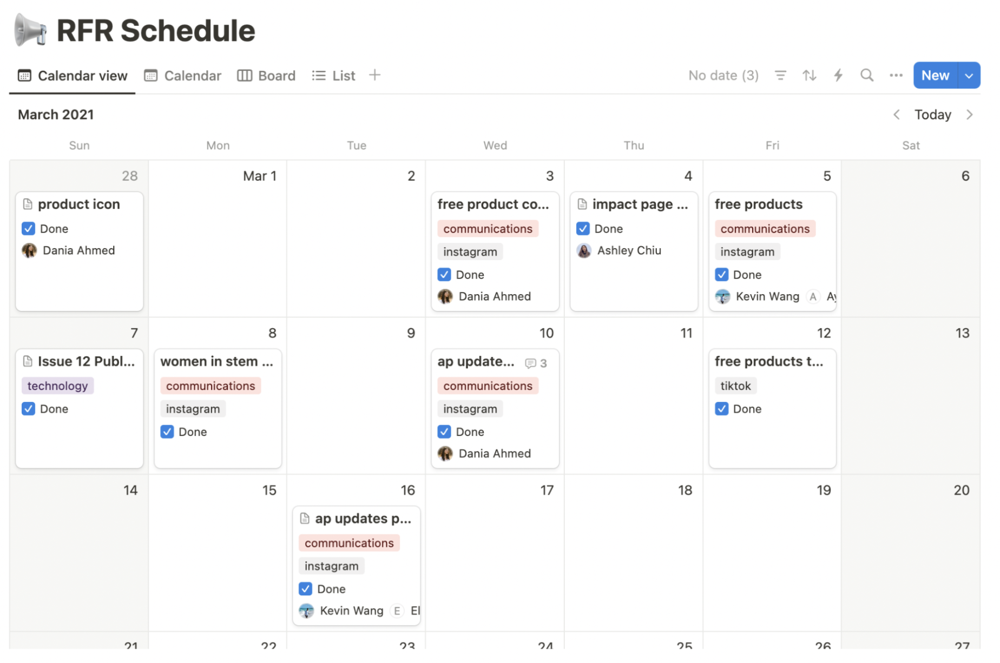
   This is an incredibly useful feature for users, and ideally we would like to incorporate a calendar feature into PlantIt. However, there are design decisions to be made on our Project Page, and we want to keep the interface informative but still simple. Is a calendar a better way of conveying deadline or key date information, or maybe something more like a timeline or Gantt chart?

2. **Notion Extreme Customizability:** Notion is widely known for its extremely customizable interface, where you can drag items on each page to order them any way you want. Furthermore, you can create customizable databases that can have different "views". These are particularly revolutionary, as they allow users to view the same information in different ways. Notion also has extremely easy linking abilities.
   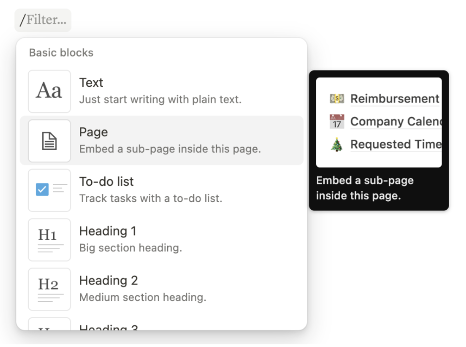
   Notion options for different page input such as text, sub-page, to-do, etc.
   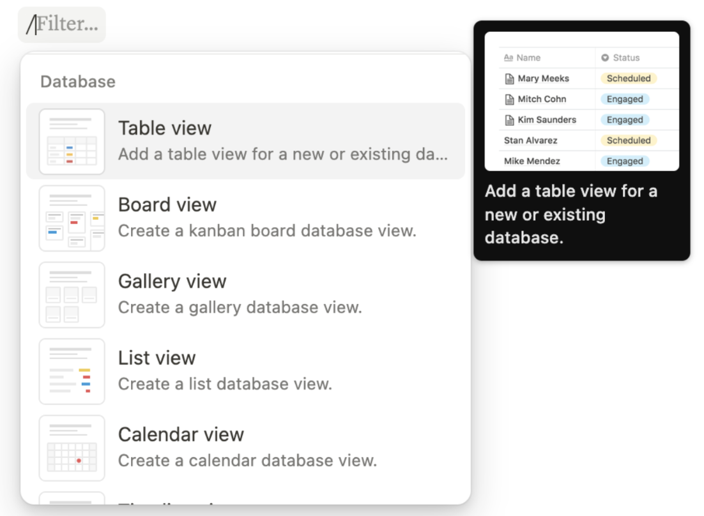
   Notion options for database views. Below is an example of the same database in two different views (Table and Timeline)
   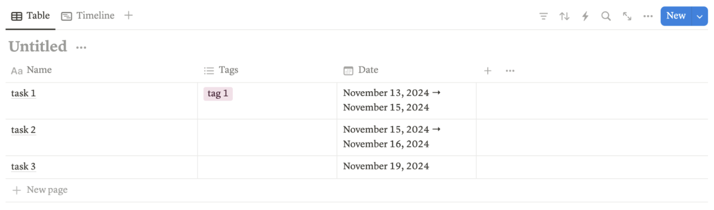
   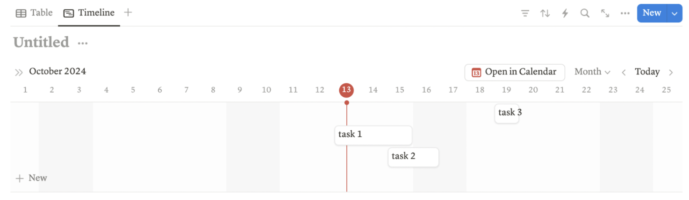
   This feature would be very difficult to implement, but would be incredible for a shared Project Page. This way, project managers could customize their "dashboard" to convey the key information they wanted. However, this method means that there is a lot of time wasted on set up, since the project manageer would have to set up their page completely from scratch. Is there a way to maybe incorporate some flexibility into the Project Page layout without sacrificing efficiency?

3. **Flora Feed:** Flora, a popular productivity pomodoro-style app, automatically posts onto a shared feed whenever a user completes a study session.
   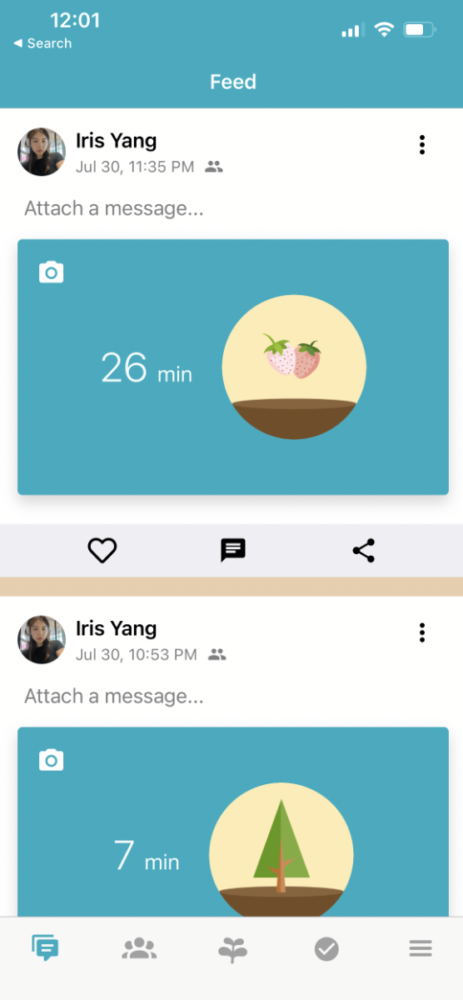
   Can we incorporate a social media style feed to show tasks that have been completed? Perhaps this might pose an issue for projects that are intended to be kept "private"? Could this be more motivating to users, if they are able to see each other complete tasks? Think similar to Strava motivation.

4. **Flora Garden and Plants:** Our reward system is heavily inspired by Flora, which "grows" a plant each time the user has a complete study session. The plant rewards are kept in a _weekly_ garden, so a new garden is started each week. Below are screenshots of the gardens of two different weeks.
   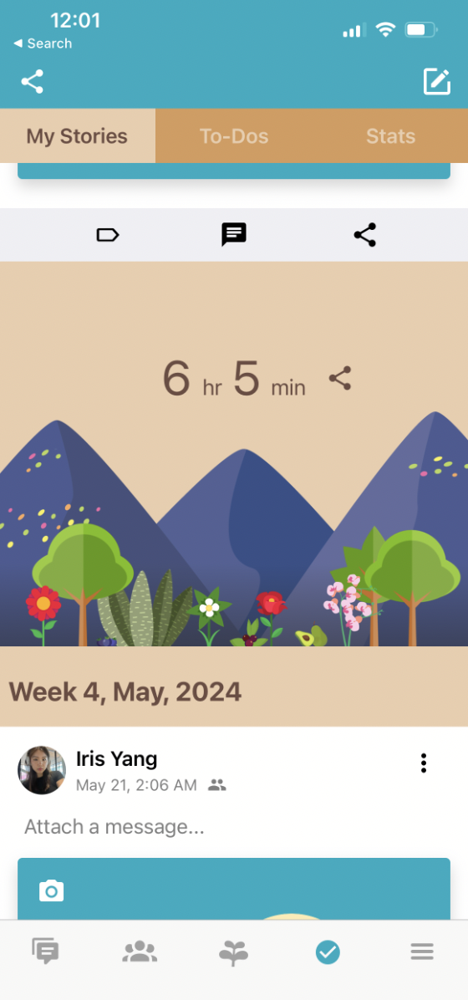
   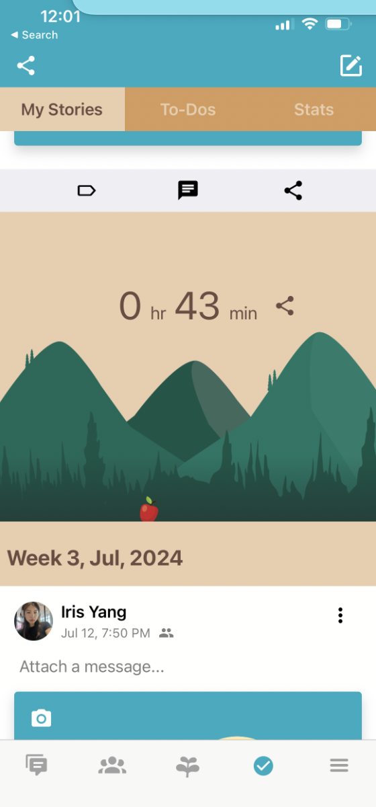
   As you can see, the first garden is particularly lush because the user had many study sessions that week, whereas the second garden is almost completely bare. How can we leverage this functionality to keep users motivated to continue growing their garden? Is it actually unmotivating to have to start over each week? What if we create a new garden for each project?

5. **Jira Gantt Charts:** Jira has a Timeline feature that is essentially a Gantt chart (shows dependencies between different tasks).
   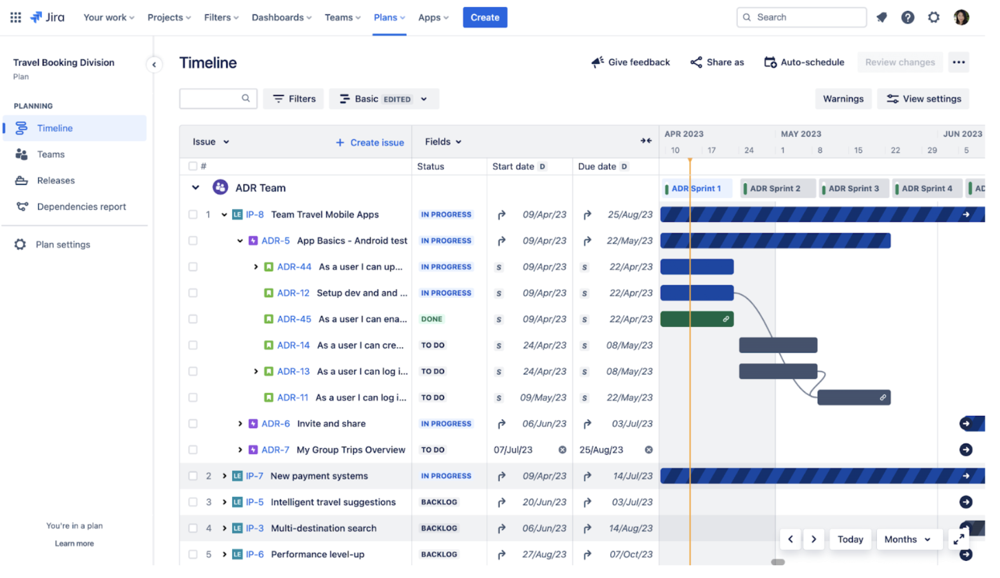
   We would like to incorporate some sort of Gantt chart type feature in order to help project teams visual time-linear progression of tasks. While the sentiment is present in the Jira Gantt charts, it is extremely cluttered and difficult to read. How can we visualize dependencies in a way that retains key information (such as task, deadline, associated user) but remains pleasant to the eye and clear to the user? What about a more customized view for just one user's tasks?

6. **Mondays.com Task Classification:** mondays.com contains a feature where it shows if a task is in progress, not done, or completed.
   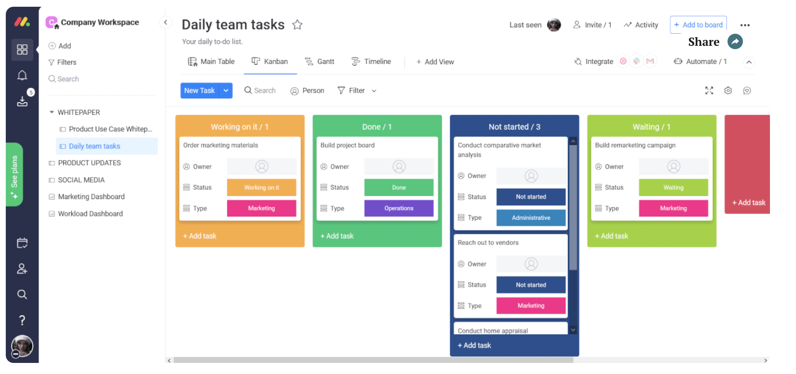
   Could we add some sort of "tagging" feature to our tasks to indicate that a task is being worked on, done, or not started? Possibly even indicate that a task is at a roadblock due to dependencies?

7. **Habitica Dashboard:** Habitica has a user dashboard which features all of a user's tasks. This is similar to having a Project Page to monitor entire project progress, but instead, monitoring a single user's tasks.
   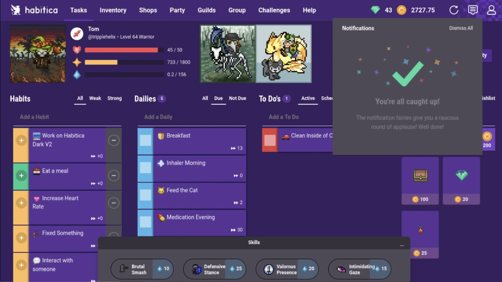
   How can we organize information for a user in a way that compiles all tasks across all their projects, but maintains the enough distinction between different projects and priorities? Could a user rank projects by importance? How can we make this dashboard appear more "inviting" or "encouraging" for users, so that they are more motivated to complete their tasks?

8. **Github Hover:** Github has a hover feature to show who is following a repo.

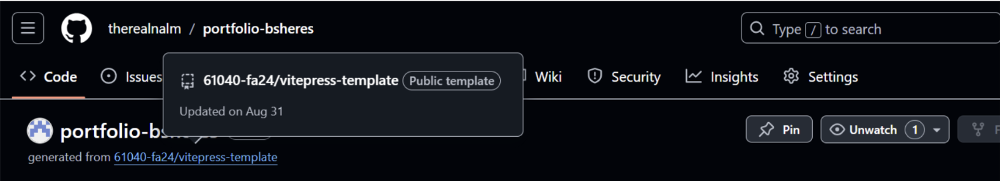
It could be useful to include an "on-hover" feature when users hover over a given task to show more information. This would reduce dashboard clutter and only show less useful information when relevant to the user. For example, who is in charge of "overseeing" or "approving" a certain task, or who has visibility over progress to remind members that someone important is managing that task.

## Brainstorming Features

1. **Plant:** Each completed task contributes to the growth of a virtual plant, which users can keep at the end of the project. This plant represents the project’s success/progress.
2. **Garden:** A personalized garden where users can see all the plants they’ve collected over their many projects, providing a visual representation of their productivity history.
3. **Fertilize a Friend:** Allows users to support teammates by helping their plants grow.
4. **User Achievements:** Recognition for milestones such as completing n tasks, finishing n projects, or visiting the project page n times. These achievements are displayed on users’ profiles.
5. **Limited-Time Events:** During special events, prioritized tasks reward bonus contribution towards plant growth, incentivizing focus on high-priority tasks.
6. **In-Game Currency:** Users earn currency by completing tasks and projects, which can be spent on items.
7. **Leveling Up:** Each task or project completed increases the user’s level, providing incentives to progress and unlocking special things.
8. **Leaderboard:** A competitive leaderboard that shows contributors ranked by contributions for each project or for each time period (e.g. weekly leaderboards).
9. **Project Manager:** Project managers have special permissions, such as creating announcements, assigning tasks, or approving final task quality.
10. **Project Page:** A central hub for each project, containing essential project information, task assignments, timelines, and updates.
11. **Gantt Charts:** Gantt charts with task dependencies visualize project timelines, progress, and dependencies, automatically updating based on task completion.
12. **Dependency Notifications:** Automatically notify team members assigned to a task of any other tasks that depend on their task. Also, automatically notify team members assigned to a task when a dependency of their task has been completed.
13. **Team Announcements:** Allows managers to broadcast important notifications to all project members.
14. **Progress Tracker:** A visual representation of the project’s progress, showing how close the team is to their goal.
15. **Productivity Graph Visualizations:** A visualization of different statistics over time such as tasks completed, enabling users to track their contributions and see trends.
16. **Task Auto-Notifications:** Automated notifications for task assignments, deadlines, and other time-sensitive events to keep users on track.
17. **Task Creation:** Enables users to create tasks within projects, adding essential details like deadlines, descriptions, and priorities.
18. **Task Assignment:** Allows managers to assign tasks to specific team members.
19. **Task Content:** Attach text, files, images, or other media directly to tasks for clearer instructions or relevant resources.
20. **Task Classification:** Categorize tasks based on context within the project, improving organization and task management.
21. **Task Approval:** Assigns a project manager or team member to review and approve completed tasks, ensuring quality control.
22. **Reward Tiers:** Project managers can assign different rewards for tasks based on difficulty, providing varied incentives and recognition.
23. **How Big Is This Piece of the Pie?:** Shows what percentage of the overall project a task represents, helping users understand the impact of their work.
24. **Assignments:** A personalized list for each user showing all their assigned tasks.
25. **Dishing Out Beef:** When someone falls short on a task, team members can “call them out,” creating transparency and accountability within the project.
26. **Giving Kudos:** Team members can endorse each other’s good work, sharing praise and recognition with the whole team.
27. Anonymous Project Member Feedback — Team members can provide feedback on tasks and projects anonymously.
28. **Big Picture:** A constant reminder (image, text, or symbol) on the project page to keep users aligned with the overall project goal.
29. **Big Brother:** Displays the team members that are monitoring a task, with names viewable on hover of their profile pictures. This increases accountability and incentive to make progress on tasks.
30. **Attaboy:** Automatic positive reaction to completing a task or making good progress.
31. **Help Wanted:** Allows team members to request assistance on tasks that are difficult to complete alone, notifying teammates of the need for collaboration.
32. **Handoff:** Allows users to transfer responsibility for a task to another team member when necessary, keeping the project moving.
33. **Accountability Buddies:** Optional partners assigned to keep the team members assigned to a task on track, with reminders and progress check-ins.
34. **Priority:** Assigns priority levels to tasks, indicating importance relative to other tasks so that team members can complete critical tasks first.
35. **Open Projects:** Projects needing additional help can be marked by team members as open to new members, encouraging team growth.
36. **Open Tasks:** A list of unassigned tasks for each project, allowing team members to take on additional responsibilities if needed.
37. **Skillsets:** A visualization of the skills of each team member, aiding in task assignment and collaboration by matching tasks to abilities.

## Key Concepts

### Concept 1: Grouping [Item]

- **Purpose:** Assign an associated label to a set of items. Used to represent a project.
- **Operational Principle:** For a project, tasks can be added to that project by grouping tasks in association with that project. Similarly, members can be added or removed by adding or removing the corresponding users from the members group associated with the project.

### Concept 2: Tasking [User]

- **Purpose:** Assign a task to a user with a description of the task, relevant media, and a corresponding deadline.
- **Operational Principle:** Part of building a house is laying the concrete, so a task is created and assigned to an individual describing what the criteria for laying the concrete is.

### Concept 3: Notifying [Time, User]

- **Purpose:** Notify a user of some announcement or reminder (string input) based on some predetermined time.
- **Operational Principle:** The user will receive a notification from the system at the given time–not before nor after. After the user has been notified, they will never receive the same notification again.

### Concept 4: Deadlining [Item]

- **Purpose:** Assign a deadline to an item, and indicate whether the deadline for that item has passed or not.
- **Operational Principle:** If an item has a deadline of t, the deadline will not have passed if the current time is before t. Once the current time has passed t, then the deadline will have passed.

### Concept 5: Depending [Item]

- **Purpose:** To indicate a linear dependency of one item on another, or that one item must come before/after another.
- **Operational Principle:** If task A cannot be completed before task B, then task A is depending on task B.

### Concept 6: Rewarding [User, Reward]

- **Purpose:** Allow users to track rewards that they have earned over the course of multiple projects.
- **Operational Principle:** If a user A wants to see what they’ve earned for their accomplishments, they can check their rewards.

## Storyboard and Sketches

### User Flow 1: The Setup

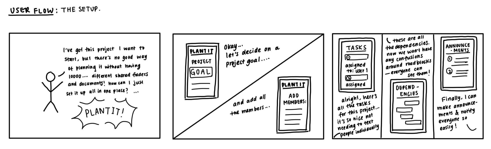

### User Flow 2: (Un)Motivated

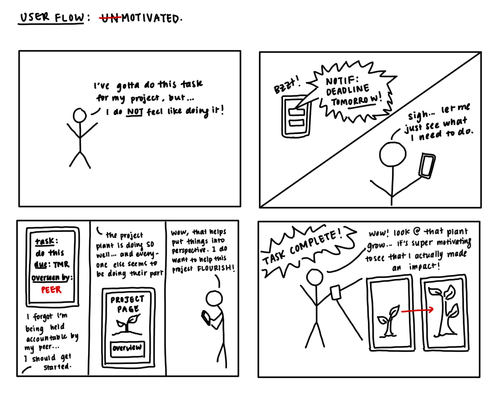

### User Flow 3: Tracker? I Hardly Know Her!

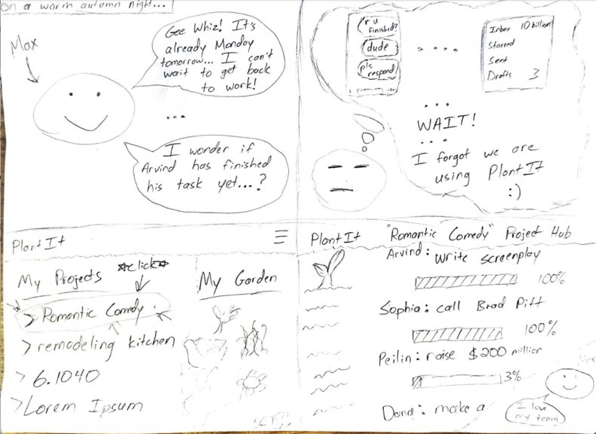
