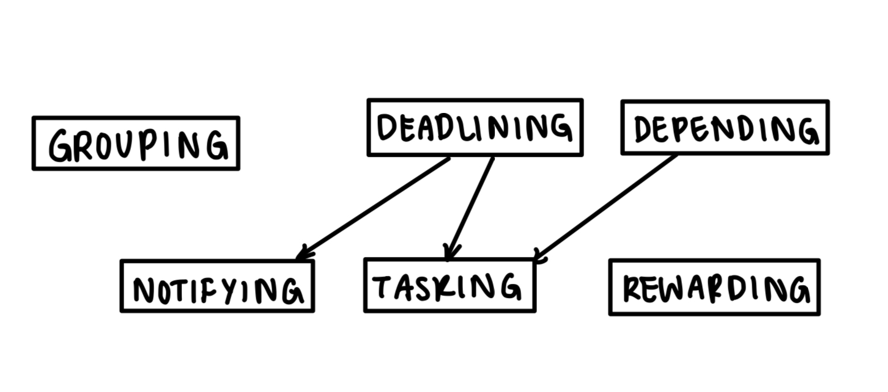
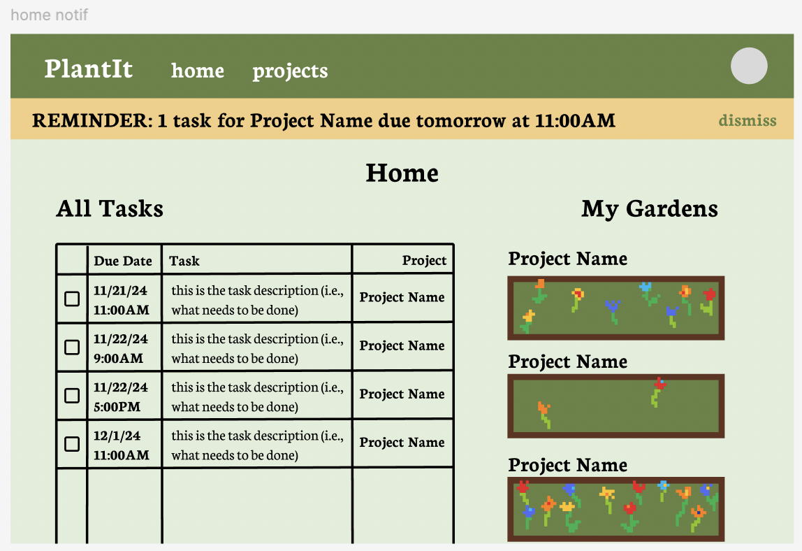
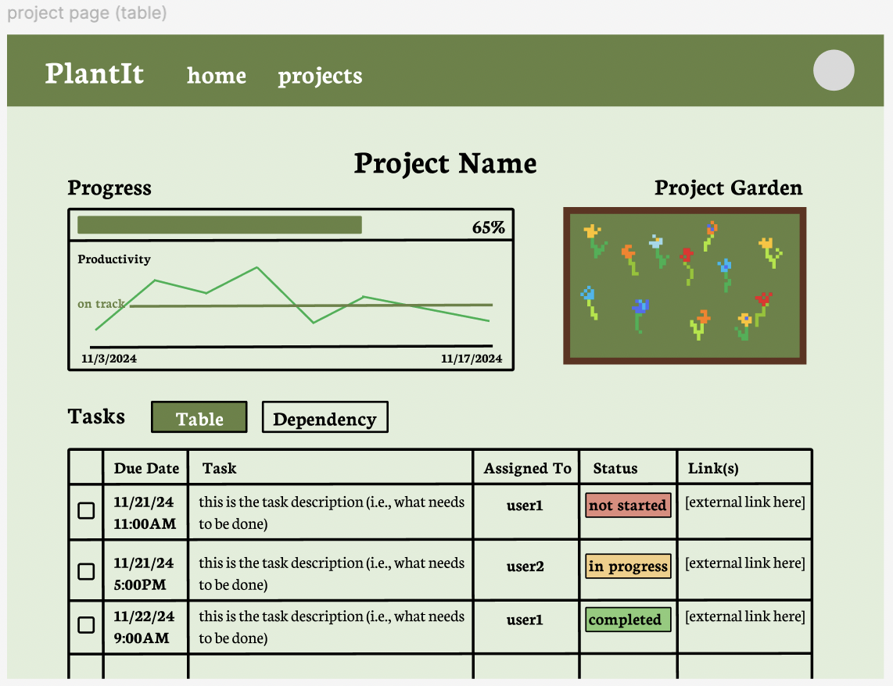
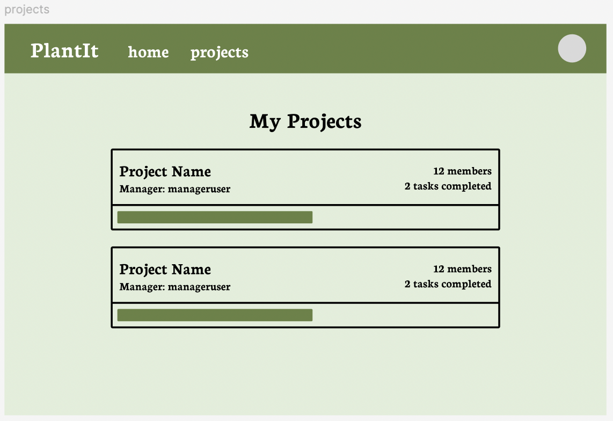
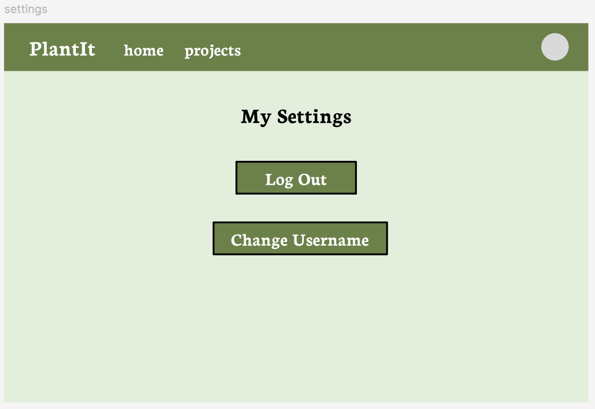
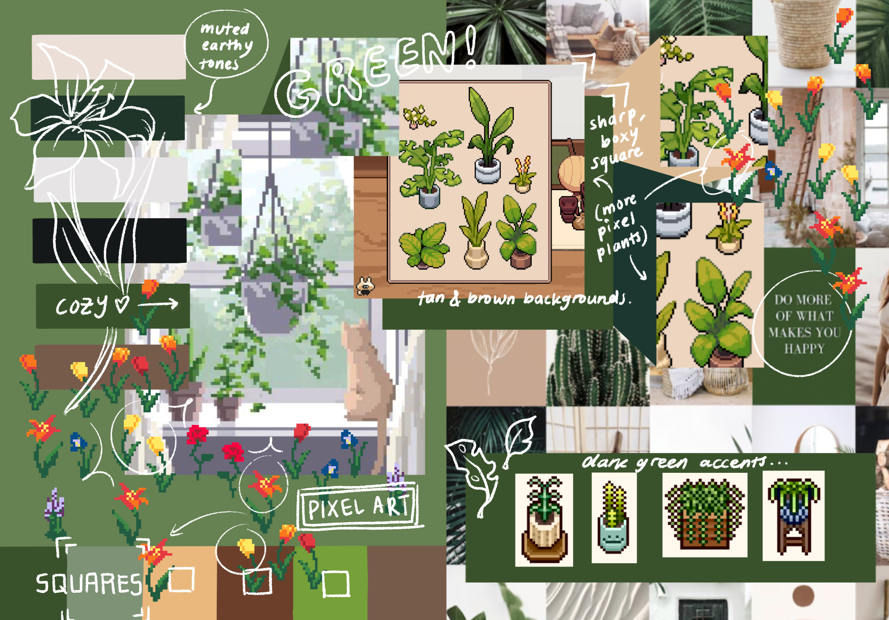
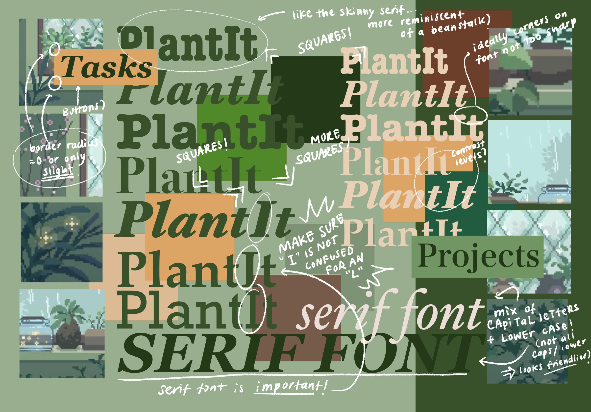
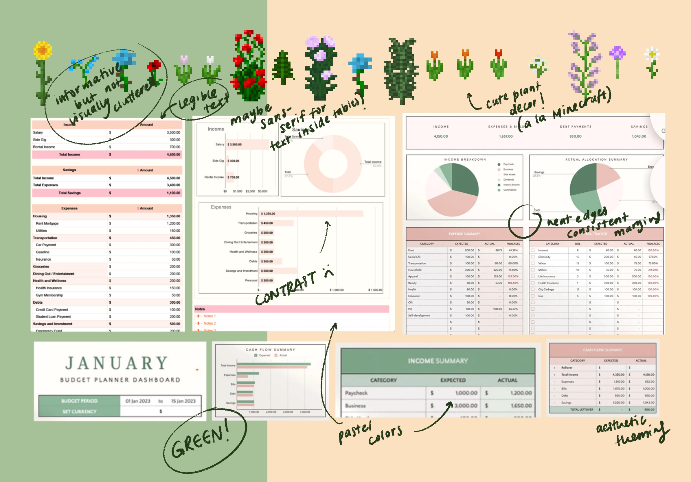

# Project Phase 3: Convergent Design

## Functional Design

### Concepts

#### Concept 1: Grouping [User, Item]

- **Purpose:** Group together a set of items with a common label.
- **Operational Principle:** For a project, tasks can be added to that project by grouping tasks in association with that project. Similarly, members can be added or removed by adding or removing the corresponding users from the members group associated with the project. Can also use to give tasks rankings of importance by putting all tasks of a certain importance in a certain group.
- **State:**
  - labels: set String
  - creator: labels --> one User
  - group: labels -> set Item
- **Actions:**

  - _getGroupFromLabel(label: String, **out** group: set Item):_ Given a label (string input), returns the group associated with that label (group labels unique, as ensured by the syncs)

  - _getGroupLabelContainingItem(i: item, **out** group: set Label):_ Given an instance of an item, returns the group labels that contain that item

  - _createGroup(creator: User, label: string, **out** group: set Item)_ Initializes a group with some given label

  - _deleteGroup(label: string):_ Deletes the group with the given label

  - _addToGroup(label: string, addition: item):_ Adds an item to a group with some given label

  - _removeFromGroup(label: string, removal: item):_ Removes an item from a group with some given label

#### Concept 2: Tasking [User, Project]

- **Purpose:** Assign a task to a user with a description of the task and relevant media in the form of links.
- **Operational Principle:** Part of building a house is laying the concrete, so you might create a task and assign it to an individual describing what the criteria for laying the concrete is with links to instructional videos.
- **State:**

  - tasks: set Task
  - assignee: tasks --> one User
  - description: tasks --> one String
  - links: tasks --> set String
  - completion: tasks --> one Boolean
  - project: tasks --> one Project

- **Actions:**

  - _createTask(user: User, description: String, links: set String, project: Project **out** task: Task):_ Creates an uncompleted task assigned to the given user with the corresponding metadata (deescription, links, etc.)

  - _getTasksForUser(user: User, **out** tasks: set Task):_ Gets all the tasks that are assigned to some given user

  - _getTaskForProject(project: Project, **out** tasks: set Task):_ Gets all the tasks that are associated to a particular project

  - _reassignTask(task: Task, newAssignee: User):_ Reassigns a given task to a new given user

  - _completeTask(task: Task):_ Mark a task as complete (set completion to True)

  - _isTaskComplete(task: Task, **out** complete: Boolean):_ Given a task, returns whether or not that task has been completed

#### Concept 3: Notifying [User, Resource]

- **Purpose:** Notify a user of a message (string input) related to a given resource.
- **Operational Principle:** The user will receive a notification from the system which contains the predetermined message about a resource. After the user has been notified, they will never receive the same notification again. Within the notification they could choose to click on a link taking them to a page for that specific resource.
- **State:**

  - notifications: set Notification
  - notifee: notifications --> one User
  - message: notifications --> one String
  - resource: notifications --> one Resource

- **Actions:**

  - _createNotification(message: String, notifee: User, resource: Resource **out** notif: Notification):_ Creates a notification with some message for a given user, corresponding to a given resource

  - _cancelNotification(notif: Notification):_ Cancels a given notification

  - _getNotificationsForUser(user: User, **out** notif: Notification):_ Gets all the notifications for a user

#### Concept 4: Deadlining [Item]

- **Purpose:** Assign a deadline to an item, and indicate whether the deadline for that item has passed or not.
- **Operational Principle:** If an item has a deadline of t, a user can check how long until the deadline or see if it has passed. If a deadline has pased
- **State:**

  - deadlines: set Deadline
  - time: deadlines --> one Date
  - item: deadlines --> one Item

- **Actions:**

  - _createDeadline(item: Item, deadline: Date, **out** deadline: Deadline):_ Creates a deadline for an item with the given date as the deadline

  - _hasPassed(deadline: Deadline, **out** hasPassed: Boolean):_ Returns whether the deadline for a given deadline has passed

  - _getDeadline(item: Item, **out** deadline: Deadline):_ Returns the deadline for a given item

  - _updateDeadline(deadline: Deadline, newDate: Date):_ Updates a given deadline to have a new date

#### Concept 5: Depending [Item]

- **Purpose:** Indicate a dependency of one item on another.
- **Operational Principle:** If you set item B to depend on item A, then item A needs to be resolved before item B can be.
- **State:**
  - item: set Item
  - dependentOn: items --> set Item
- **Actions:**

  - _getDependencies(item: Item, **out** dependencies: set Dependency):_ Given an item, return all the other items that the item is dependent on.

  - _setDependency(itemB: Item, itemA: Item, **out** dependency: Dependency):_ Create a dependency where item B depends on item A

  - _removeDependency(itemB: Item, itemA: Item):_ Remove the dependency between Item B and Item A (Item B no longer depends on Item A)

#### Concept 6: Rewarding [User]

- **Purpose:** Allows for the creation of rewards and awarding of rewards to users.
- **Operational Principle:** After creating reward r, it can be awarded to users. If r is awarded to a user and we get all of that user’s rewards, then r will always be part of the set of rewards returned.
- **State:**
  - rewards: set Reward
  - rewardName: rewards --> one String
  - rewardIcon: rewards --> one String
  - rewardUsers: rewards --> set User
- **Actions:**

  - _getAllRewards(**out** rewards: set Reward):_ Gets all rewards

  - _getRewardsForUser(user: User, **out** rewards: set Reward):_ Gets all rewards for a user

  - _createReward(name: String, icon: String, user: User, **out** reward: Reward):_ Create a reward for a given user with an associated name and icon

### Syncs

- _**sync** createProject(name: String, users: User):_

  - Create a new group of users for the project with label name
  - Create a new group of tasks for the project with label name

- _**sync** createTask(project: String, assignee: User, description: String, links: String[], deadline: Time, dependencies: Task[]):_

  - Check if assignee is assigned to project
  - Create the task with the necessary properties
  - Create a deadline correlated to the task
  - Add any prereqs with dependencies
  - Create a set of predetermined deadlines (1 day before due, 3 before due) and associate them with notifications

- _**sync** completeTask(task: Task)_
  - Change the completion status of the task to True
  - Reward team members with a randomly-generated reward that they don’t already have
  - Notify team members of tasks that depend on this that this task has been completed
- _**sync** canStartTask(task: Task)_
  - Look through all dependency tasks and return True if all dependencies’ completion statuses are True. Otherwise, return False.
- _**sync** notify()_
  - Notification made 1 day before deadline // maybe include in creation of task?
  - Go through all existing deadlines for tasks. Any tasks that are 1 day before due trigger creation of a notification reminding the associated user
- _**sync** checkUserTasks(user:User project:? String)_
  - Go through all tasks and return the ones that have the correct user. Limit to within a project if name specified
  - Go through all deadlines for tasks and return the associated deadlines with each task
- _**sync** removeProjectUser(project: String, user: User)_
  - Check if user is on project
  - If so remove them from project group
  - Check all tasks in project for tasks assigned to user and change assignee to null
  - Create notification for project manager user saying that the task is now unassigned
  - Remove all notifications assigned to that user about tasks on that project
- _**sync** nudge(task: taskID)_

  - Create notification for task’s user to nudge them

- _**sync** teamAnnouncement(msg: String)_
  - Create a notification for each member of the team with the corresponding msg
- _**sync** transferResponsibility(task: objectId, newAsignee: User, assigner: User)_
  - Check that assigner is the project’s manager
  - Check that the newAsignee is assigned to the current project
  - Change task.Assignee to the new user

### Dependency Diagram

## Wireframes

The Figma wireframes can be found [here](https://www.figma.com/design/JToOgsDPdpZINDW2EwgOEO/PlantIt?node-id=0-1&t=P96KNIsurW1nUtSI-1).

### Walkthrough

The first frame depicts the home page, which is the equivalent of the user's personal home. It contains all the tasks for that specific user, as well as the user's Gardens. The idea is that the user is rewarded a plant for every task they complete, and so the user's view of the Garden for each project is a view of all the plant rewards that _that user_ has received for that project (i.e., correspond to all tasks that have been completed so far _by that user_).

On the top is a notification that indicates that the user has 1 task due tomorrow for some Project. The user can click dismiss, which will keep the user on the Home page but get rid of the notification. The user can also click the notification to navigate to that Project's page.

On the Project page, there is a project Garden that is similar to the user's view of the Garden for that project, but contains the plant rewards of _all_ the members of the project (i.e., correspond to all tasks that have been completed so far _by every member_). There is also a graph depiction of the Project's progress so far (based on the tasks completed). Finally, at the bottom there is a display for the tasks associated with that project. Below is a picture of the table view, but the user is able to toggle between that and the Gantt view. When developing the wireframe, we considered having the table view and Gantt view side by side on the Project page. However, this ended up appearing very cluttered and made it hard to include all the relevant information for each view. We also wanted to avoid the user needing to scroll to see all the relevant components of the page. So, we decided on the view toggle buttons so that each display can take up the full width of the page.

On the Projects tab, there is a display for all the projects that that user is a member of. We initially had each component just contain the Project name and a progress bar. However, this was not very informative for the user, and we thought that it might be helpful to have additional key information about the project, such as who was the "manager", the number of members, and indicators for the progress so far.

Finally, by clicking the profile on the top right, the user is able to access their profile settings and perform actions such as log out, or change their username.

## Heuristic Evaluation

### Usability Heuristics

**Discoverability:**

- One aspect of a project management app that can be difficult to intuit is figuring out what permissions you have in regards to editing project files. A solution we can implement to help solve this discoverability problem is to use on-hover changes to the cursor depending on whether or not permission to edit that resource is granted. For example, a project manager may be able to make changes to the project roster, while a regular team member cannot. If the project manager hovers over the roster and sees their cursor change, it becomes apparent that they have the option to make changes. This also helps to improve efficiency with experienced users when they have different roles across projects.

**Pleasantness:** PlantIt is nothing if not pleasant.

- Our color palette is designed to be a welcoming, cozy colorway that inspires the user to grow their projects as well as their gardens. We want simplicity to be one of the defining aspects of PlantIt, so we don’t want to overburden users with too much information. Every additional layer of complexity introduces a tradeoff that clashes with our goal of pleasantness. Our goal is for PlantIt to be accessible at “first glance”, and then to allow for more complexity to emerge upon digging. In order to separate our project management app from the more streamlined, corporate apps that already exist we want to make PlantIt inviting to the user. This can be accomplished through the use of rounded edges, peaceful imagery, and whimsical fonts.

### Physical Heuristics

**Perceptual fusion:** How can our UI account for the dynamic nature of time-dependent tasks?

- It might potentially be confusing if a user is unsure of whether or not the project status is up-to-date. Is it obvious that the task list and its corresponding completion statuses are valid at the present moment? One possible solution is to include some form of reassurance by way of a “last updated” tag near the top of each project page. We do currently have status indicators next to each task, which is great, but there’s not an easy way to identify if that status is stale or not.
- It would be helpful to include a graphic of team members and when they last logged in to PlantIt. It may make sense to show some sort of color-coded system for team member status (e.g. green for currently online, yellow for online recently, and red if the user hasn’t logged in for a very long time). This kind of functionality would help to prevent bottlenecks.

**Gestalt principles:**

- Surroundedness: PlantIt utilizes surroundedness to convey the structure of our app. We have clearly divided boundaries between the various pieces of the project page: progress, garden, and tasks. We might want to introduce even more surroundedness by separating the foreground from the background. As the wireframe currently stands, there’s a common light green shade that exists everywhere except for the navbar. We could further separate the aforementioned sections (progress, garden, tasks, etc.) with more colors, borders, or an artistic use of reification.
- Common Fate: We may want to use the _common fate_ principle to more clearly indicate which pieces of a project phase belong to the user. For instance, we could take advantage of _relative size_ for our garden in order to indicate which plants and rewards the session user is responsible for. Another option is to leverage the _similarity_ principle, where we can change something as simple as the color, outline, or orientation for each resource that belongs to a user. This could also apply to tasks and other contributions made by the session user.

### Linguistic Heuristics

**Speak a user’s language:** Overall, the concepts in the wireframe do a good job of speaking in clear, user-friendly terms.

- The terms “Project”, “Dependency”, and “Task” are pretty self-explanatory for users, because they are common terms that are often used across any project, and do not encompass any new features that are app-specific. The notification terminology (“Reminder”, “Dismiss”, etc.) is also extremely clear to users.
- The term “Garden” appears obvious given the visuals of the Project gardens, but there could be more explanation or clarification for the purpose of the gardens. This could be done by adding an on-hover pop up with a brief explanation of the purpose of the Gardens and how to add more plants to each Garden. Or, there could be a short explanation under the “Garden” heading on the Home and/or Project page.
- Similarly, the project progress visualizations could be confusing to new users who are not used to the interface. The “on track” line might not be clear, and could use an on-hover pop up explanation like the one explained above.

**Consistency:** The wireframes are relatively consistent across the different pages.

- The language and headings for Projects, Tasks, and Gardens are the same across the different pages. This makes it easy for the user to keep track of what concept they are interacting with, and intuitively understand which components might link to the same page (for example, some Project page).
- The NavBar is consistent across all pages, which makes it easy for users to navigate across pages. However, it could be useful to have some sort of indication (such as a highlight or underline) on the NavBar text to indicate which page it is currently on. For example, if the user is on the home page, the “home” text heading would be underlined. This would make it clearer for the user and make their experience more efficient since there is less risk of them clicking on a page that they are already on.
- The Garden component is always in the top right of the page on which it is being displayed. This allows the user to maintain a sense of organization across pages, and in particular prevents the user from needing to relocate the areas where relevant information are ordered on the page. For example, if a user were looking at their Tasks on the Home page, then their focus would be on the left side of the screen. If the user then navigates to a specific Project page, the “relevant” project information would stay on the left side of the screen, whereas the gamification portion (Garden) remains on the right side, so the user would not need to readjust their focus.
- The display of the task information is in tables that are similar to existing productivity apps, which means that the barriers to entry for using PlantIt will be relatively low since the users will not have to learn to read a completely new type of interface. The Gantt chart format is also similar to those found in existing productivity/project management apps.

## Visual Design Study

In PlantIt, we hope to create an interface that is both functional and cozy. On the gamification side, we plant to include elements of pixel art for the plants (as seen in the Color and Style Study). Our color palette plays into the theme of our app--plants!--and is a mix of greens and neutral tones. These tones are visually pleasant and not too loud, which keeps with our "cozy" theme and also helps the brighter plant pixel art pop! Since our app uses the pixel art style, it feels appropriate to keep the other components of the app relatively square or rectangular as well. This can be done by setting the border radius of box components to be lower (like 0 or 1). The sharper edges also help convey a sense of organization, as opposed to rounder edges that might convey a "friendlier" vibe. For our logo and headings, we want to use a serif font--mainly for readability reasons. Specifically, we are concerned that if we use a sans-serif font for our app name (PlantIt), the "I" might be easily confused for an "L" (case in point: the sans-serif font for this page). The serif font also conveys a more "plant-y" feel, particularly the fonts that are a bit skinnier--almost reminiscent of a beanstalk. For the tables and graphs that we plan on implementing to visualize the tasks, we want to keep the interface light and simple as to not create too much visual clutter. Thus, for the tables or smaller text, it might be better to use a sans-serif font.

### Color and Style Study

### Font Study

### Table Formatting Study

## Project Plan

### Concept Implementation Order

Before implementing the concepts we have defined above, we will be copying over the Authentication and Sessioning concepts from the Assignments for user functionality.

1. Grouping
2. Tasking
3. Notifying
4. Depending
5. Deadlining
6. Rewarding

### Task Breakdown

| Deadline | Group Member            | Task                                                                                                                                         | Associated Concept(s) |
| :------- | :---------------------- | :------------------------------------------------------------------------------------------------------------------------------------------- | :-------------------- |
| 11/21/24 | Iris                    | Paste Auth-ing and Sessioning concept from previous assignments                                                                              | Auth-ing, Sessioning  |
| 11/21/24 | Iris, Ben               | Paste Grouping concept from previous assignments \- Iris, modify to fit current needs (data representation class and RESTful routes) \- Iris | Grouping              |
| 11/23/24 | Ben                     | Implement Tasking data representation class and actions                                                                                      | Tasking               |
| 11/23/24 | Ben                     | Implement Deadlining data rep class and actions                                                                                              | Deadlining            |
| 11/23/24 | Ben                     | Implemented Notifying data rep class and actions                                                                                             | Notifying             |
| 11/25/24 | Brian                   | Create RESTful route headings \+ descriptions                                                                                                | RESTful Routes        |
| 11/25/24 | Iris                    | Implement Project sync using Grouping                                                                                                        | Grouping              |
| 11/26/24 | Brian                   | Create functioning front-end for testing RESTful routes                                                                                      | Testing               |
| 11/26/24 | Iris                    | Start implementing front-end basics: NavBar, basic styling/css (separate from P4 submission)                                                 | Styling               |
| 11/27/24 |                         | **P4 DEADLINE**                                                                                                                              |                       |
| 11/29/24 | Ben                     | Implement Rewarding data representation class and actions                                                                                    | Rewarding             |
| 11/29/24 | Ben                     | Implement Depending data representation class and actions                                                                                    | Depending             |
| 11/29/24 | Iris                    | Create image icons for Rewarding \+ figure out css for displaying                                                                            | Rewarding             |
| 11/30/24 | Brian                   | Implement syncs                                                                                                                              | Syncs                 |
| 11/30/24 | Brian                   | Create Project Manager special privilege functionality                                                                                       | User Actions          |
| 11/30/24 | Iris                    | Create Project Page Vue file                                                                                                                 | Project Page          |
| 11/30/24 | Brian                   | Create Home Page Vue file                                                                                                                    | Home Page             |
| 11/30/24 | Tommy                   | Create Settings Page Vue file                                                                                                                | Settings Page         |
| 11/30/24 | Tommy                   | Create “Create Project Form” component                                                                                                       | Project Components    |
| 12/2/24  | Tommy                   | Create “Add Project Member” component                                                                                                        | Project Components    |
| 12/2/24  | Ben                     | Create “Home Task View” component                                                                                                            | Home Components       |
| 12/2/24  | Iris                    | Home Page Styling                                                                                                                            | Styling               |
| 12/2/24  | Iris                    | Project Page Styling                                                                                                                         | Styling               |
| 12/2/24  | Tommy                   | Settings Page Styling                                                                                                                        | Styling               |
| 12/2/24  | Iris                    | Create “Home Garden” component                                                                                                               | Home Components       |
| 12/2/24  | Brian                   | Create “Project Task Table View” component                                                                                                   | Project Components    |
| 12/2/24  | Ben                     | Create “Project Task Gantt View” component                                                                                                   | Project Components    |
| 12/2/24  | Tommy                   | Create “Project Garden View” component                                                                                                       | Project Components    |
| 12/3/24  | Tommy                   | Create “Nudging” form and notification functionality                                                                                         | User Actions          |
| 12/4/24  | Ben                     | Create Transfer Project Manager responsibility form                                                                                          | User Actions          |
| 12/4/24  | Ben                     | Create “Project Graph Visualization” component                                                                                               | Project Components    |
| 12/5/24  | Brian                   | Finish user testing framework (plan for tasks to complete, loose script, etc.)                                                               | Testing               |
| 12/5/24  |                         | **P5 DEADLINE\!\!\!\!\!**                                                                                                                    |                       |
| 12/6/24  | Iris, Brian, Ben, Tommy | Identify candidates for user testing                                                                                                         | Testing               |
| 12/8/24  | Brian                   | User testing complete                                                                                                                        | Testing               |
| 12/8/24  | Brian                   | Summarize user testing takeaways                                                                                                             | Testing               |
| 12/9/24  | Ben                     | Plan out app modification based on user testing results                                                                                      | Iterating             |
| 12/10/24 | Brian                   | Implement app modifications                                                                                                                  | Iterating             |
| 12/11/24 |                         | **P6 DEADLINE**                                                                                                                              |                       |

### In the Event of Unforeseen Circumstances

Since we are human, it is possible and almost inevitable that we will run into challenges along that way and may not be able to complete the assignment as planned. In the case of setbacks, we are prepared to forgo the implementation of the dependency concept and any related actions or syncs. That would also remove the inclusion of Gantt charts from our UI. If necessary, we could also reduce the use of notifications to only be sent before deadlines as opposed to when users are dropped or want to ask for another user to take over their task. Further, instead of continuous notifications, we can reduce the searching of notifications to only occur when a user loads the new page. Lastly, if we run into issues we might also remove the graph displaying all project tasks.
