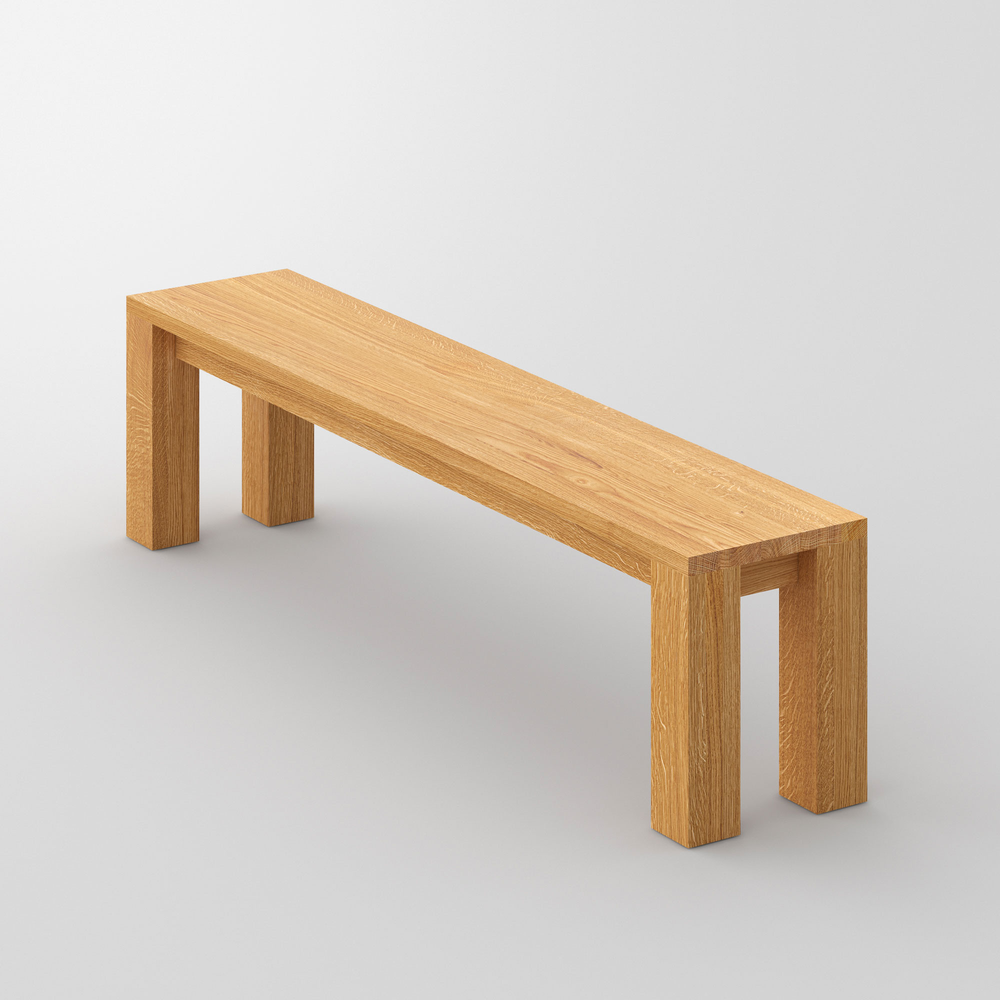

# Lecture 12 Blog: Visual Design Objectivity

As Max presented numerous examples of what makes for good and bad visual design, I couldn't help but wonder how we're able to discern what is actually good and bad. I'm not trying to pose the question of if there is objective good or bad in the world but rather if there is objective good design and bad design. For this blog, I'd like to argue that there is not, but that it doesn't really matter.

Good design is highly subjective but within the context of different cultures can begin to feel more objective. Although some designs are objectively more condusive to certain actions, what makes them "good" is that humans have become accustomed to being used in that way and that is something that changes from culture to culture. For example, consider a Japanese-style table and a bench.

As an American, the table feels like poor design because we are not accustomed to sitting on the ground. Whereas in Japan, the American bench may make less sense because it is so tall and offers no cushioning. Conversely, in their repsective cultures, the design may be perceived as good.

The takeaway from this is not that the world of design is chaos and you should inspect everything critically, but rather that in order to make good visual design, you should draw inspiration from other instances of whatever you're designing in your culture at that time. Looking back at Apple's IOS 4 homescreen and apps we might be repelled by what we consider poor design

But **this isn't poor design!** At the time it was heralded as cutting edge because it was. At the time, that was new, exciting, and culturally accepted good design for a homescreen and apps. In many ways its very different than what we have today but that's because design standards have changed and will continue to do so. And there is noo inal "perfect design" that we will ultimately reach and then stop iterating. Culture and society keep moving and so does good design, so you should too.
